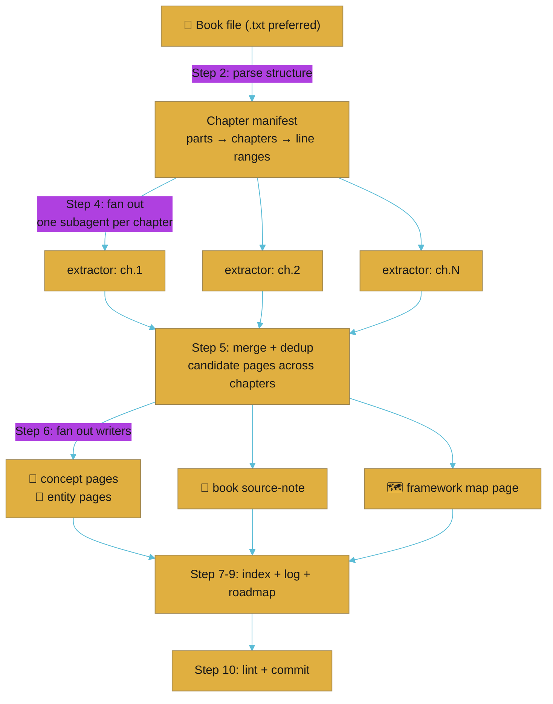

# Ingest Book

Turn a full-length non-fiction book into a compounding set of interlinked wiki pages. A single `/ingest text` pass would flatten an 80k-word book into one unreadable note. A book is structured knowledge — parts, chapters, a central framework, recurring concepts — and it deserves to be decomposed the way it was written, then re-woven with wikilinks so its ideas connect to every other book in the vault.

This skill is **vault-agnostic**. It never assumes a topic or a vault name; both come from the arguments. It works for an ADHD book, a habits book, a therapy book, a business book, or a tech book equally.

## When this runs

`/ingest book <path> --vault <name>` — the `/ingest` router detects the `book` keyword (or a book-shaped file: `.epub`, `.mobi`, or a large `.txt`/`.pdf` the user calls a book) and delegates here.

## The shape (why it's a fan-out, not a single pass)



The extractor subagents keep the book's 80k+ words OUT of the main context — each reads only its own chapter slice and returns structured candidates. The main thread only ever holds the manifest and the merged candidate list.

## Step 1: Parse arguments and resolve the vault

- Source path = the argument after `book`.
- `--vault <name>` → resolve to `vaults/<name>` (prefix `llm-wiki-` if absent, matching the on-disk dir). If omitted and only one vault exists, use it; else ask.
- `--reingest` → the book already has a source-note; re-run and update existing pages instead of erroring on duplicates.
- Read the vault's `CLAUDE.md` (default domain, conventions, whether concept pages carry a `book:` tag) and the `wiki-templates` skill for page-type/frontmatter rules.

## Step 2: Get clean text + parse structure

**Prefer `.txt`.** If given a `.txt`, use it directly. Otherwise convert to text first:

| Input | Convert with | Check first |
|-------|--------------|-------------|
| `.epub` / `.mobi` | `ebook-convert "<in>" "<out>.txt"` (Calibre) or `pandoc "<in>" -t plain -o "<out>.txt"` | `which ebook-convert || which pandoc` |
| `.pdf` | `pdftotext -layout "<in>" "<out>.txt"` | `which pdftotext` (`brew install poppler`) |
| `.docx` | `pandoc "<in>" -t plain -o "<out>.txt"` | `which pandoc` |

If a converter is missing, tell the user the one-line `brew install` and stop — don't guess at structure from a binary.

**Copy the raw source into the vault:** `cp "<original>" "$VAULT/raw/"` (keep the original extension; also keep the working `.txt` if it was converted). Frontmatter later points here.

**Parse the structure.** Find the parts/chapters and their line ranges so each can be handed to one extractor:

```bash
grep -n -iE "^(part|chapter|section|introduction|conclusion|appendix|epilogue|prologue)" "$RAW_TXT" | head -80
wc -l "$RAW_TXT"
```

Build a **chapter manifest**: an ordered list of `{ id, title, startLine, endLine }`. Rules:
- One extraction unit per chapter. If a "part" has no sub-chapters, the part is the unit. If chapters are very long (>4k lines), split at major sub-headings.
- Aim for extraction units of roughly 500–3000 lines each. Merge trivially short front/back matter (title page, dedication) into a single "front matter" skim or skip it.
- Skip pure index/bibliography/notes sections for concept extraction, but note the author's key cited sources for entity pages.

If no chapter markers exist (rare for non-fiction), fall back to fixed ~2500-line windows and label them "Section 1..N".

## Step 3: Detect the book's central framework

Before fanning out, skim the table of contents / introduction (first ~300 lines) to name the book's **organising model** — the thing the map page will diagram. Examples: "Seven Pillars", "Four Laws of Behaviour Change", "Cognitive Distortions", "Five Dysfunctions". Note it; the writers use it in Step 6.

## Step 4: Fan out — one extractor subagent per chapter

Dispatch extractor subagents (Task tool, `Explore` or `general-purpose` agent type) in parallel, in batches that respect the concurrency you have. Give each **only its line range** and a strict output contract. The extractor reads via `Read` with `offset`/`limit` on the raw `.txt` — it does not load the whole book.

Extractor prompt contract (per chapter):

> You are extracting structured knowledge from ONE chapter of a book for a wiki. Read ONLY lines `<start>`–`<end>` of `<RAW_TXT>` using Read offset/limit. Do not read the rest of the book. Return JSON only, no prose:
> ```json
> {
>   "chapter": "<id + title>",
>   "chapter_summary": "3-5 sentence plain-English summary",
>   "concepts": [{ "name": "...", "slug": "kebab-case", "definition": "1-2 sentences", "how_it_works": "2-4 sentences", "tags": ["..."], "is_technique": true|false }],
>   "frameworks": [{ "name": "...", "components": ["..."], "summary": "..." }],
>   "entities": [{ "name": "...", "type": "person|organization|tool|framework|method|publication|clinical-reference", "why": "1 sentence on relevance" }],
>   "techniques": [{ "name": "...", "slug": "...", "steps": ["..."], "when_to_use": "..." }],
>   "key_claims": ["load-bearing claim with the chapter's own framing"],
>   "quotes": [{ "text": "verbatim short quote", "context": "..." }],
>   "worked_examples": ["a concrete example the author gives, with real specifics"]
> }
> ```
> Extract only what is meaningfully developed in the chapter, not every passing mention. Keep quotes short and verbatim.

Collect all extractor JSON. This is the only book-derived content that enters the main context, and it's compact.

## Step 5: Merge and dedupe into a page plan

Across all chapters:
- **Dedupe concepts by slug/meaning.** A concept discussed in 3 chapters becomes ONE concept page whose "developed in" cites all 3 chapters. Prefer the fullest definition; merge the mechanics.
- **Promote techniques** to their own concept page (`is_technique: true`) or fold minor ones into a parent concept.
- **Collapse the frameworks** into the single central model (Step 3) plus any sub-models.
- **Dedupe entities.** One page per person/tool/reference; merge "why relevant" across chapters.
- Decide the final page list and check it against existing vault pages (Glob `wiki/concepts`, `wiki/entities`) so `--reingest` and cross-book overlaps UPDATE rather than duplicate. Apply the `context-pack` reference skill for near-duplicate detection.

Produce a written **page plan**: source-note (1), map page (1), concept pages (N), entity pages (M), optional comparison pages. Show the user this plan as a checklist before writing (or proceed directly if the vault is empty and the plan is uncontroversial — say what you're creating).

## Step 6: Fan out — writers create the pages

Dispatch writer subagents (the `ro:wiki-curator` agent type when available, else `general-purpose`). Batch by page so each writer owns a small set and no two writers touch the same file. Each writer follows `wiki-templates` frontmatter exactly and the vault's `CLAUDE.md`. Understanding-first is mandatory (see engine CLAUDE.md § Output Style):

- **Concept pages** (`wiki/concepts/<slug>.md`, page-type `concept`): Definition → How It Works → Examples (use the worked examples) → Related Concepts (`[[wikilinks]]`) → Sources. Frontmatter tags include the topic + a `book:` tag naming the book slug. Cite the book's Part/Chapter inline.
- **Entity pages** (`wiki/entities/<slug>.md`, page-type `entity`): author, cited researchers, named tools/methods, clinical references (e.g. DSM-5). The **author** page is always created.
- **Book source-note** (`wiki/sources/<book-slug>.md`, page-type `source-note`, `source-type: book`): Overview → Key Takeaways → Structure (parts/chapters) → Detailed Notes (linking to every concept page) → Quotes → Sources. Frontmatter: `author`, `date-accessed`, `raw-file`, and `sources` pointing at the raw book file(s). This note is the hub that links to everything the book produced.
- **Framework map page** (`wiki/<book-slug>-map.md`, page-type `summary`): a top-level page whose centrepiece is a **mermaid diagram** of the book's central model (Step 3), each node linking to its concept page. Add a one-paragraph plain-English orientation and an "Open questions" section. This is the page a reader opens first to understand the book at a glance.

Cross-linking rules (from `wiki-templates`): same-vault `[[page]]`; cross-vault via the `[short:slug](obsidian://...)` markdown-link form. Link on first mention, update `related:` frontmatter both ways.

## Step 7: AI Insight Summary on the source-note

A book is long-form source material, so the engine's AI Insight Summary contract fires. After the source-note is written:

```
/ai-insight-summary $VAULT/wiki/sources/<book-slug>.md --position after-h1 --open
```

This adds the top-of-doc `> [!summary] AI Insight Summary` callout (synthesis + open questions, not restatement) and opens the note in Obsidian. Pass `--no-open` if the user asked to stay quiet.

## Step 8: Update the index

Per the progressive-index spec in `wiki-templates`:
- Each new concept/entity → one line in L1 (Topic Map) + a full row in L2.
- The book source-note → L2 Sources table.
- The map page → L1 (one line) + L2.
Update the L0 Purpose only if this book adds a new topic the vault should advertise.

## Step 9: Update log and ROADMAP

Append to `log.md`:

```markdown
## [YYYY-MM-DD] ingest-book | <Book Title> — <Author>
- Source type: book
- Raw file: raw/<filename>
- Structure: <N parts / M chapters>
- Pages created: [[<book-slug>]] (source-note), [[<book-slug>-map]], <count> concepts, <count> entities
- Central framework: <name>
---
```

Move the book from ROADMAP "In progress"/"Next up" to "Recently completed".

## Step 10: Lint and commit

```
/lint --vault <name>
```

Fix broken links / orphans it flags (a fresh book ingest should leave the source-note and map well-connected; orphan concept pages usually mean a missing backlink from the map).

Then commit inside the vault repo:

```bash
git -C "$VAULT" add .
git -C "$VAULT" commit -m "✨ feat: ingest <Book Title> (<Author>)"
```

(Respect the user's weekday commit-hours rule if applicable — set `GIT_AUTHOR_DATE`/`GIT_COMMITTER_DATE` when committing Mon–Fri inside 08:30–18:00.)

## Step 11: Report

- What the book was and its central framework.
- The page tree created (source-note → map → concepts/entities), as wikilinks.
- Cross-book connections found (concepts that link to pages from other books already in the vault).
- Suggested follow-ups: related books to ingest, open questions the map surfaced, cross-vault links worth adding (e.g. from `llm-wiki-adhd`).

## Notes

- **Stay involved (Karpathy's rule):** show the page plan before writing; discuss key takeaways after.
- **Don't over-create.** A 300-page book is typically ~1 source-note + 1 map + 8–20 concept pages + 3–8 entities. Hundreds of pages means the extraction kept passing mentions — tighten Step 5.
- **Concept pages are named after the idea, not the book**, so a later book referencing the same idea updates the existing page and the cross-book graph grows.
- **Reingest** (`--reingest`) updates existing pages and adds a new "developed in" citation rather than duplicating.

## Dependencies

- For non-`.txt` input: Calibre (`ebook-convert`) or `pandoc` for epub/mobi; `poppler` (`pdftotext`) for pdf. None needed when the user supplies a clean `.txt`.
