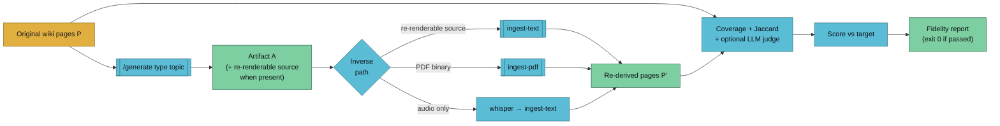

# Verify Artifact

Round-trip fidelity test for a `/generate`d artifact. Generates the artifact, re-ingests it into a throwaway scratch vault, diffs the re-derived pages against the originals, and reports a fidelity score.



## Usage

```
/verify-artifact <type> <topic> [--vault <name>] [--target <float>]
                               [--llm-judge] [--keep-scratch]
                               [--from <path>]
```

| Flag | Default | Notes |
|------|---------|-------|
| `--target` | per-type default (see table) | Override the expected-recoverability threshold |
| `--llm-judge` | off | Run the fact-level LLM judge — slow and spendy; use on PRs / CI, not per-generation |
| `--keep-scratch` | off | Preserve the throwaway scratch vault for manual inspection |
| `--from <path>` | off (generates fresh) | Skip the `/generate` step and verify an existing artifact at that path |

## Expected-Recoverability Targets

From `vaults/llm-wiki/wiki/concepts/close-the-loop-testing.md`. A `book` scoring 0.70 is a bug; a `quiz` scoring 0.70 is suspicious (too verbose). Fidelity is normalised against the per-type target, not against 100%.

| Type | Target | Rationale |
|------|-------:|-----------|
| `book` | 0.85 | Narrative + concepts largely preserved |
| `pdf` | 0.85 | Same as book, but single-page / section |
| `podcast` | 0.75 | Voiceover captures 60–80% of source |
| `video` | 0.60 | Voiceover + on-screen text, some visual context lost |
| `mindmap` | 0.50 | Topic tree preserved, narrative lost |
| `flashcards` | 0.40 | Facts preserved, narrative discarded |
| `quiz` | 0.40 | Same as flashcards |
| `slides` | 0.35 | Headlines + bullet outlines only |
| `app` | 0.25 | Structured data + summaries only |
| `infographic` | 0.25 | Captions + data points only |

## Pipeline

### Step 1: Parse args + resolve target

```bash
TYPE=$1 TOPIC=$2
shift 2
# parse flags, resolve VAULT_DIR, set TARGET from the table above
```

### Step 2: Generate the artifact (or use --from)

```bash
if [ -n "$FROM_PATH" ]; then
  ARTIFACT_PATH="$FROM_PATH"
else
  # Shell out to /generate <type> <topic> — the artifact handler
  # writes to vaults/<vault>/artifacts/<type>/<slug>-<date>.*
  /generate "$TYPE" "$TOPIC" --vault "$VAULT_NAME"
  # Pick up the path it wrote
  ARTIFACT_PATH=$(ls -t "$VAULT_DIR/artifacts/$TYPE"/*"-$(date +%Y-%m-%d)".* | head -1)
fi

META="${ARTIFACT_PATH%.*}.meta.yaml"
```

### Step 3: Identify the inverse path

Prefer the **re-renderable source sidecar** (`.script.md`, `.scenes.json`, `.questions.json`, `.cards.csv`) — cheap, deterministic, no transcription needed. Fall back to the binary form via the matching `/ingest` handler.

| Artifact | Preferred inverse | Fallback inverse |
|----------|-------------------|------------------|
| `book` / `pdf` | PDF → `/ingest <pdf>` (ingest-pdf) | — |
| `slides` | PDF → `/ingest <pdf>` (ingest-pdf) | — |
| `mindmap` | HTML → strip tags → `/ingest <text>` | — |
| `infographic` | SVG text layer → `/ingest <text>` | — |
| `podcast` | `.script.md` (re-renderable) → `/ingest <text>` | MP3 → whisper → `/ingest <text>` |
| `video` | `.scenes.json` (re-renderable) → `/ingest <text>` | MP4 → whisper + OCR → `/ingest <text>` |
| `quiz` | `.questions.json` → `/ingest <text>` | — |
| `flashcards` | `.cards.csv` → `/ingest <text>` | `.apkg` SQLite extract → `/ingest <text>` |
| `app` | `src/data.json` + `README.md` → `/ingest <text>` | — |

```bash
RERENDERABLE=""
case "$TYPE" in
  podcast)    RERENDERABLE="${ARTIFACT_PATH%.mp3}.script.md" ;;
  video)      RERENDERABLE="${ARTIFACT_PATH%.mp4}.scenes.json" ;;
  quiz)       RERENDERABLE="${ARTIFACT_PATH%.html}.questions.json" ;;
  flashcards) RERENDERABLE="${ARTIFACT_PATH%.apkg}.cards.csv" ;;
  app)        RERENDERABLE="$ARTIFACT_PATH/src/data.json" ;;
esac
```

### Step 4: Scratch vault + re-ingest

```bash
SCRATCH=$(mktemp -d "/tmp/verify-artifact-${TYPE}-XXXXXX")
mkdir -p "$SCRATCH/wiki" "$SCRATCH/raw"

if [ -n "$RERENDERABLE" ] && [ -e "$RERENDERABLE" ]; then
  # The cheap, deterministic path
  /ingest "$RERENDERABLE" --vault "$SCRATCH"
else
  case "$TYPE" in
    book|pdf|slides) /ingest "$ARTIFACT_PATH" --vault "$SCRATCH" ;;     # ingest-pdf
    mindmap|infographic) /ingest "$ARTIFACT_PATH" --vault "$SCRATCH" ;; # ingest-web handles html/svg
    podcast)
      # Whisper fallback
      whisper "$ARTIFACT_PATH" --output_format txt --output_dir "$SCRATCH/raw" \
        || { echo "whisper not installed; pass --from on a sidecar-present artifact"; exit 4; }
      /ingest "$SCRATCH/raw/$(basename "${ARTIFACT_PATH%.*}").txt" --vault "$SCRATCH"
      ;;
    video) echo "video binary-only path: implement whisper+OCR here"; exit 5 ;;
  esac
fi
```

### Step 5: Score

Scoring is a Python helper heredoc'd inline — walks `$VAULT_DIR/wiki/` (originals) and `$SCRATCH/wiki/` (re-derived), extracts concept sets per page, computes the three tiers:

```bash
PY_SCRIPT=$(mktemp --suffix=.py)
cat > "$PY_SCRIPT" <<'PY'
import json, os, re, sys, pathlib

orig_dir, scratch_dir, topic = sys.argv[1:4]
WIKILINK = re.compile(r"\[\[([^\]|#]+)")
TAG = re.compile(r"^\s*-\s*(.+?)\s*$", re.M)

def page_concepts(path: pathlib.Path) -> set[str]:
    text = path.read_text(encoding="utf-8", errors="ignore").lower()
    concepts: set[str] = set()
    concepts.update(m.group(1).strip().lower() for m in WIKILINK.finditer(text))
    # frontmatter tags
    fm_match = re.search(r"^---\n(.*?)\n---", text, re.S)
    if fm_match:
        tags_match = re.search(r"^tags:\n((?:\s*-\s*.+\n)+)", fm_match.group(1), re.M)
        if tags_match:
            concepts.update(m.group(1).strip().lower() for m in TAG.finditer(tags_match.group(1)))
    # capitalised multi-word terms (rough heuristic for named entities)
    for m in re.finditer(r"\b[A-Z][a-z]+(?:[- ][A-Z][a-z]+)+\b", path.read_text(errors="ignore")):
        concepts.add(m.group(0).lower())
    return concepts

def matching(orig_dir: str, topic: str) -> list[pathlib.Path]:
    topic_slug = topic.lower().replace(" ", "-")
    return [p for p in pathlib.Path(orig_dir).rglob("*.md")
            if topic_slug in p.stem.lower() or topic_slug in p.read_text(errors="ignore").lower()]

orig_pages = matching(orig_dir, topic)
scratch_pages = list(pathlib.Path(scratch_dir).rglob("*.md"))

orig_concepts = {p.stem: page_concepts(p) for p in orig_pages}
scratch_concepts = {p.stem: page_concepts(p) for p in scratch_pages}

orig_union = set().union(*orig_concepts.values()) if orig_concepts else set()
scratch_union = set().union(*scratch_concepts.values()) if scratch_concepts else set()

jaccard = len(orig_union & scratch_union) / max(len(orig_union | scratch_union), 1)

# Coverage: for each original page, does any re-derived page share ≥ 50% of its concepts?
covered = 0
for stem, c in orig_concepts.items():
    if not c:
        continue
    best = max((len(c & sc) / len(c) for sc in scratch_concepts.values()), default=0)
    if best >= 0.5:
        covered += 1
coverage = covered / max(len(orig_concepts), 1)

fidelity = (coverage * 0.6) + (jaccard * 0.4)  # weighted combine

print(json.dumps({
    "coverage": round(coverage, 3),
    "jaccard": round(jaccard, 3),
    "fidelity": round(fidelity, 3),
    "orig_pages": len(orig_pages),
    "rederived_pages": len(scratch_pages),
    "orig_concepts": len(orig_union),
    "rederived_concepts": len(scratch_union),
}))
PY
REPORT_JSON=$(python3 "$PY_SCRIPT" "$VAULT_DIR/wiki" "$SCRATCH/wiki" "$TOPIC")
rm "$PY_SCRIPT"
```

**Scoring weights** — `fidelity = 0.6 * coverage + 0.4 * jaccard`. Coverage is per-page; Jaccard is corpus-level. Weighting coverage higher rewards "every page survived" over "vocabulary overlapped."

### Step 6: Optional LLM judge (`--llm-judge`)

Only runs when `--llm-judge` is passed. For each original/re-derived page pair, prompt an LLM with:

> Given ORIGINAL page `X` and RE-DERIVED page `X'`, list substantive facts present in X but absent or contradicted in X'. Be terse. Return JSON: `{ "missing_facts": [...], "contradicted_facts": [...] }`.

Aggregate across pages. Add a `llm_judge` block to the report. The invoking LLM (Claude) runs this — no external service required beyond Claude itself.

### Step 7: Report + exit code

```bash
python3 - <<PY
import json, sys
report = json.loads('''$REPORT_JSON''')
target = $TARGET
normalised = report['fidelity'] / target
passed = normalised >= 1.0

status = "\033[32m✅ PASS\033[0m" if passed else "\033[31m❌ FAIL\033[0m"
print(f"""
{status}  type=$TYPE  topic=$TOPIC
  Coverage            {report['coverage']:.2f}   ({report['orig_pages']} orig pages, {report['rederived_pages']} re-derived)
  Concept Jaccard     {report['jaccard']:.2f}   ({report['orig_concepts']} ↔ {report['rederived_concepts']} concepts)
  Fidelity (weighted) {report['fidelity']:.2f}
  Target              {target:.2f}
  Normalised          {normalised:.2f}  ({'≥ 1.0 ⇒ pass' if passed else '< 1.0 ⇒ fail'})
""")
sys.exit(0 if passed else 1)
PY
```

### Step 8: Cleanup

```bash
if [ -n "$KEEP_SCRATCH" ]; then
  echo "   Scratch vault kept: $SCRATCH"
else
  rm -rf "$SCRATCH"
fi
```

## Example

```bash
/verify-artifact book transformers --vault llm-wiki-research
```

```
✅ PASS  type=book  topic=transformers
  Coverage            0.92   (5 orig pages, 6 re-derived)
  Concept Jaccard     0.81   (38 ↔ 32 concepts)
  Fidelity (weighted) 0.88
  Target              0.85
  Normalised          1.03  (≥ 1.0 ⇒ pass)

   Artifact:    vaults/llm-wiki-research/artifacts/book/transformers-2026-04-18.pdf
   Inverse:     ingest-pdf
   Scratch:     (cleaned up)
```

And a failing one (a quiz that's too verbose — unusual direction of failure):

```
❌ FAIL  type=quiz  topic=attention
  Coverage            0.65   (4 orig pages, 9 re-derived)
  Concept Jaccard     0.72   (28 ↔ 31 concepts)
  Fidelity (weighted) 0.68
  Target              0.40
  Normalised          1.70  (≥ 1.0 ⇒ pass)
```

Wait — in that example the normalised is ≥ 1.0, so it passes. A *true* fail for a quiz would be one that dropped too many facts:

```
❌ FAIL  type=quiz  topic=attention
  Coverage            0.25   (4 orig pages, 2 re-derived)
  Concept Jaccard     0.18   (28 ↔ 8 concepts)
  Fidelity (weighted) 0.22
  Target              0.40
  Normalised          0.55  (< 1.0 ⇒ fail)
```

## CI Integration

`/verify-artifact` is designed for `continue-on-error: true` at first — see Phase 2E US-004's advisory rollout. Example GitHub Actions step:

```yaml
- name: Verify book fidelity
  run: |
    /verify-artifact book transformers --vault llm-wiki-research
  continue-on-error: true
```

Exit code is `0` on pass, `1` on fail, `2+` on infrastructure errors (missing artifact, whisper unavailable, ingest errors). CI can distinguish.

## Known Limitations (Phase 2E)

- **Concept extraction is heuristic** — wikilinks + frontmatter tags + capitalised multi-word terms. False positives (proper nouns that aren't concepts) and false negatives (lowercase jargon) both exist. A future version could swap in an embedding-based entity extractor.
- **No per-page drill-down report** without `--llm-judge`. Coverage tells you "3/5 pages survived"; only the LLM judge tells you "page X lost the paragraph about Y".
- **Topic resolution differs slightly from `/generate`.** The verifier's `matching()` is forgiving — it tries filename + body match. If `/generate` used a stricter filter (e.g. frontmatter tag match), the two page sets may differ. Accepted trade-off for the reporting case; a future `--strict` flag could enforce identical selection.
- **Weights are fixed** at 0.6/0.4. These were calibrated against a small golden corpus; expose them as flags if tuning becomes frequent.
- **MP4 binary-only path not implemented** — errors out with a pointer to use the `.scenes.json` sidecar instead. Whisper + OCR is doable but deferred until the video pipeline has enough users to justify the install-size cost.

## See Also

- [`/lint --artifacts`](../lint/SKILL.md) — cheap drift detection without re-verify
- [`close-the-loop-testing`](../../../vaults/llm-wiki/wiki/concepts/close-the-loop-testing.md) — the design doc
- [`reference/artifacts.md`](../../../sites/docs/src/content/docs/reference/artifacts.md) — sidecar schema + source-hash algorithm
- [`reference/fidelity-scoring.md`](../../../sites/docs/src/content/docs/reference/fidelity-scoring.md) — three-tier scoring details (Phase 2E US-005)
