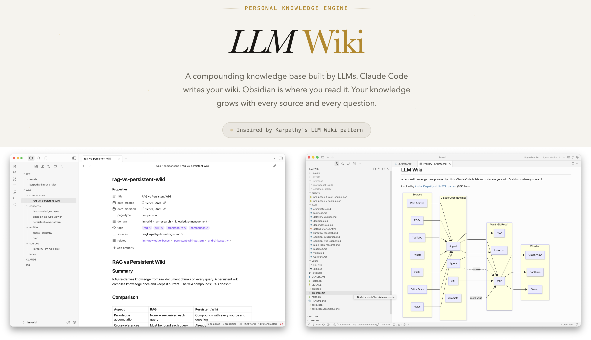
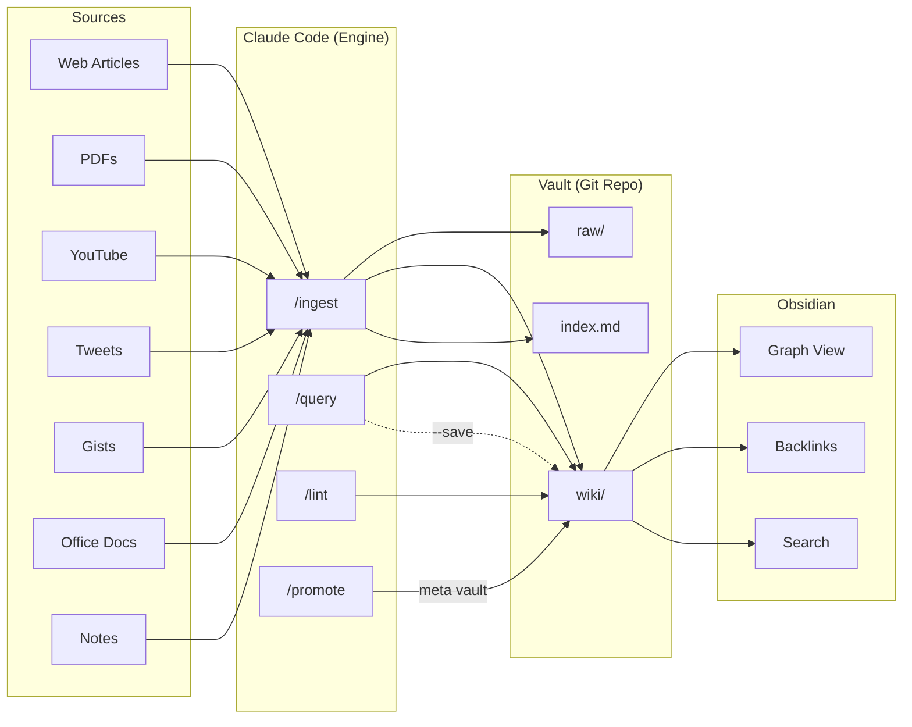

# LLM Wiki

**[Website](https://ronancodes.github.io/llm-wiki/)** | **[Docs](https://ronancodes.github.io/llm-wiki/docs/)** | **[Get Started](https://ronancodes.github.io/llm-wiki/docs/getting-started/quick-start/)**

A personal knowledge base powered by LLMs. Claude Code builds and maintains your wiki. Obsidian is where you read it.

Inspired by [Andrej Karpathy's LLM Wiki pattern](https://gist.github.com/karpathy/442a6bf555914893e9891c11519de94f) (55K likes).





## Why?

Most AI + documents workflows are **stateless**. RAG re-derives knowledge every query. Nothing compounds.

LLM Wiki is different. When you add a source, Claude **reads it, extracts key information, and integrates it into a persistent wiki** -- updating entity pages, revising summaries, flagging contradictions, maintaining cross-references. The knowledge compounds with every source and every question.

## Quick Start

```bash
git clone https://github.com/RonanCodes/llm-wiki.git
cd llm-wiki
./install.sh    # installs dependencies (uses Homebrew)
claude          # launch Claude Code
```

Then in Claude Code:

```
/vault-create my-research --domain ai-research
/ingest https://some-article.com --vault my-research
/query "What are the key takeaways?" --vault my-research
```

Open `vaults/my-research/` in [Obsidian](https://obsidian.md) to browse your wiki.

For the full interactive guide: `open docs/getting-started.html`

## Commands

| Command | What it does |
|---------|-------------|
| `/vault-create <name>` | Create a new vault with full wiki structure |
| `/vault-import <path>` | Import an existing Obsidian vault or markdown folder |
| `/vault-status` | Show all vaults with page counts and status |
| `/ingest <source>` | Process any source into wiki pages |
| `/query "question"` | Ask questions, get answers with citations |
| `/search "terms"` | Full-text search across wiki pages |
| `/lint` | Health-check wiki for issues |
| `/promote <vault>` | Graduate knowledge between vaults |
| `/slides "topic"` | Generate presentation from wiki content |
| `/setup` | First-time setup on a new machine |

## Supported Sources

| Source | Example | Deps |
|--------|---------|------|
| Web articles | `https://blog.example.com/post` | None |
| PDFs | `path/to/paper.pdf` | auto |
| Office docs | `path/to/report.docx` | auto |
| YouTube | `https://youtube.com/watch?v=...` | auto |
| Tweets | `https://x.com/user/status/...` | None |
| GitHub Gists | `https://gist.github.com/...` | None |
| Text / notes | Pasted text or `.md` files | None |

Dependencies marked "auto" are installed on first use. No manual setup needed.

## How It Works

**One engine, many vaults.**

- **Engine**: 22 Claude Code skills in this repo
- **Vaults**: Separate git repos of markdown files (your data, gitignored)
- **Viewer**: Obsidian for browsing, graph view, backlinks, search

Each vault:
```
vaults/my-research/
|-- raw/              <- source documents (immutable)
|-- wiki/
|   |-- index.md      <- catalog of all pages
|   |-- sources/      <- source summaries
|   |-- entities/     <- people, orgs, tools
|   |-- concepts/     <- ideas, patterns
|   '-- comparisons/  <- synthesis pages
|-- log.md            <- activity log
'-- CLAUDE.md         <- vault conventions
```

## Docs

| Document | What's in it |
|----------|-------------|
| [Getting Started](docs/getting-started.html) | Interactive setup guide (open in browser) |
| [Roadmap](docs/roadmap.md) | Full project roadmap with mermaid diagrams |
| [Workflow](docs/workflow.md) | Daily usage guide |
| [Dependencies](docs/dependencies.md) | All tools with install methods |
| [Web Clipper Setup](docs/obsidian-web-clipper.md) | Obsidian Web Clipper workflow |
| [Dataview Queries](docs/dataview-queries.md) | Useful Obsidian Dataview queries |
| [Architecture](docs/architecture.md) | Technical design |
| [Vision](docs/vision.md) | Why this exists |

## Staying Updated

```bash
git remote add upstream https://github.com/RonanCodes/llm-wiki.git
git pull upstream main
```

Your vaults and private skills are gitignored -- engine updates won't touch your data.

## Credits

- Pattern: [Andrej Karpathy](https://x.com/karpathy/status/2039805659525644595)
- Build technique: [Ralph Wiggum loop](https://ghuntley.com/ralph/) by Geoffrey Huntley
- Skills: inspired by [Matt Pocock](https://github.com/mattpocock/skills) and [Snarktank](https://github.com/snarktank/ralph)

## License

MIT
