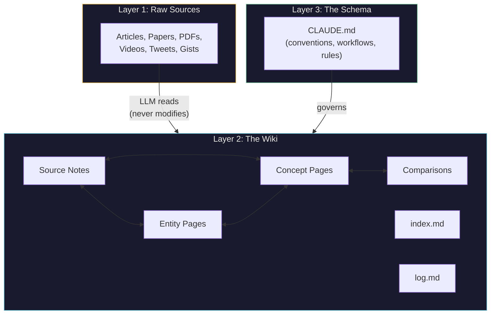
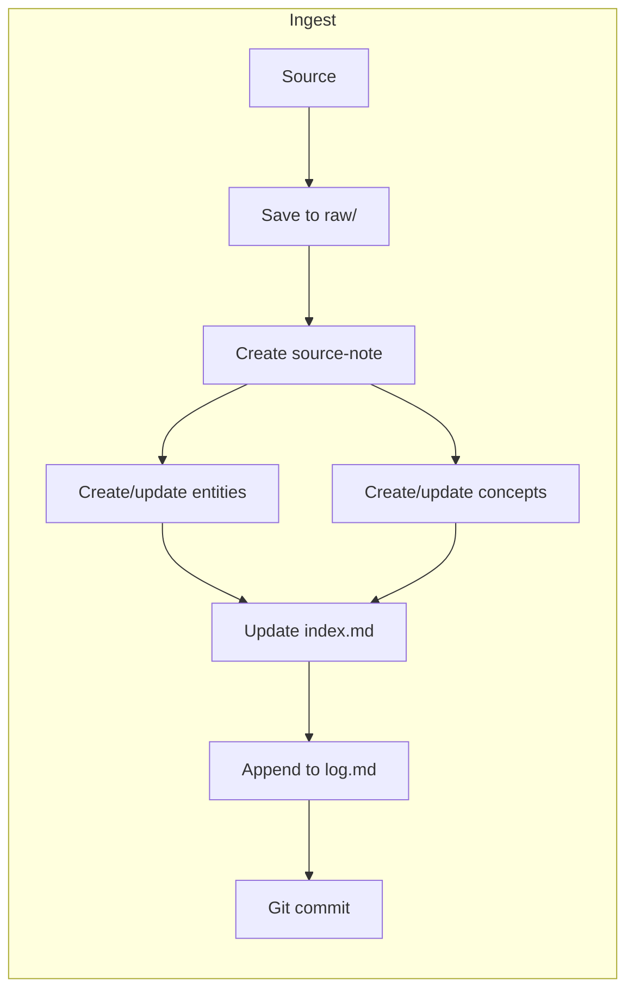
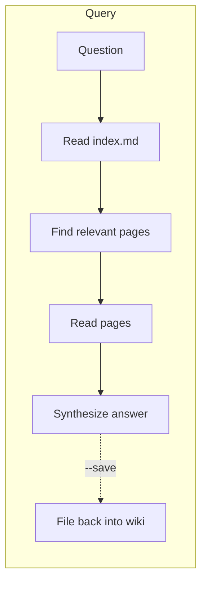
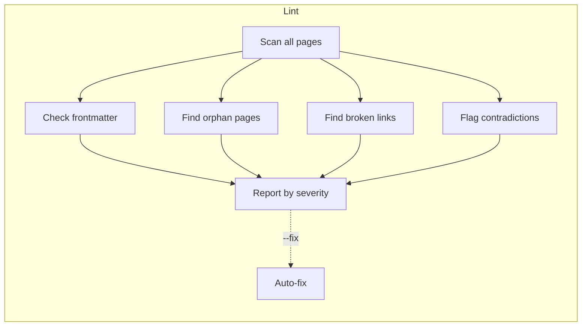
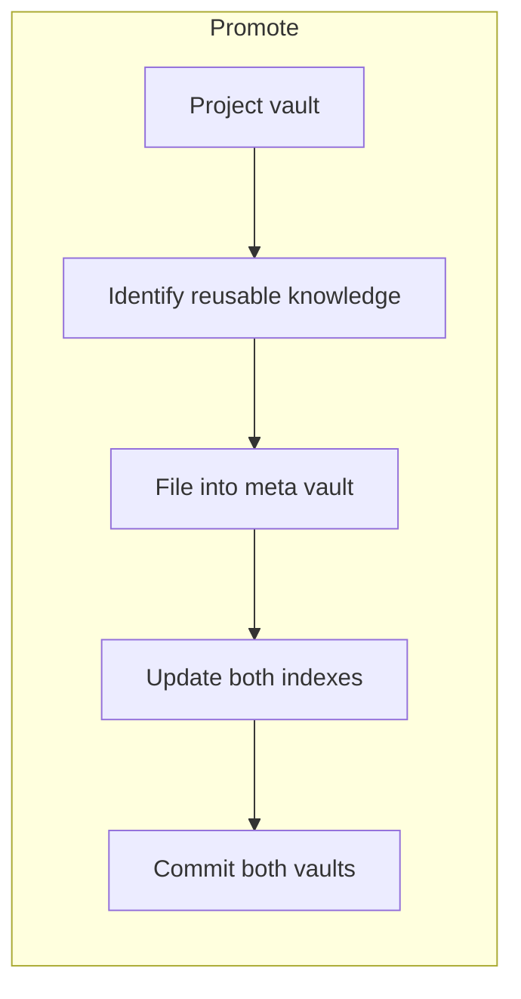

# Architecture

## Three Layers (from Karpathy's pattern)



1. **Raw sources** — curated collection of source documents (articles, papers, images, data files). Immutable — LLM reads but never modifies. Source of truth.
2. **The wiki** — LLM-generated markdown files. Summaries, entity pages, concept pages, comparisons, overview, synthesis. LLM owns this entirely.
3. **The schema** — CLAUDE.md that tells the LLM how the wiki is structured, conventions, and workflows.

## Our Extension: One Engine, Many Vaults

```
llm-wiki/                            <- public repo (the engine)
├── .claude/
│   └── skills/                       <- ingest, query, lint, promote skills
│       ├── read-tweet.md             <- utility: read X/Twitter posts (FXTwitter API)
│       └── read-gist.md             <- utility: read GitHub gists (raw URL fetch)
├── app/                              <- Next.js web app
│   ├── app/
│   │   ├── api/
│   │   │   ├── ingest/              <- POST: drop a URL or text
│   │   │   ├── query/              <- POST: ask the LLM against a vault
│   │   │   ├── capture/            <- POST: quick thought for later
│   │   │   └── browse/             <- GET: read wiki pages
│   │   ├── page.tsx                 <- dashboard: vault overview, recent activity
│   │   ├── vault/[name]/           <- browse a vault's wiki pages
│   │   ├── search/                 <- search across vaults
│   │   └── chat/                   <- query interface
│   └── lib/
│       ├── claude.ts                <- Claude API client
│       ├── vault.ts                 <- read/write markdown in vault dirs
│       └── git.ts                   <- auto-commit logic
├── docker-compose.yml
├── Dockerfile
├── CLAUDE.md
├── vaults/.gitkeep                   <- gitignored, users create their own
└── .gitignore
```

### Vaults (private, separate repos)

```
vaults/
├── meta/                             <- long-lived cross-project knowledge
│   ├── raw/
│   ├── wiki/
│   │   ├── tech/                    <- Next.js deployment, Vercel patterns, etc.
│   │   ├── strategy/               <- go-to-market, pricing, marketing
│   │   └── index.md
│   └── CLAUDE.md                    <- thin config: vault name, domain, conventions
├── personal/                         <- private: health, goals, journal
├── project-alpha/                    <- per-project, archived when shipped
└── project-beta/
```

**Vaults are data, not applications.** No skills, no tools, no logic. Just markdown + raw sources + a thin CLAUDE.md for conventions. The engine operates on them.

**Each vault is its own git repo.** Different privacy levels, independent lifecycles, clean history, size independence. Gitignored from the main engine repo.

### Vault-specific CLAUDE.md (thin config, not skills)

A vault's CLAUDE.md only contains conventions, not logic. Examples:
- "This vault tracks competitors — entity pages need 'Last Updated' and 'Sources' count"
- "Tag everything with `client: acme` in frontmatter"
- "Use character/theme/chapter page types"

Vault-specific skills are possible but rare (1% of cases) — e.g., parsing lab results, ingesting market data CSVs. Even then, prefer putting them in the main skills folder.

## Four Core Operations



### Ingest
Drop a new source into raw/, tell the LLM to process it. Flow: LLM reads source, discusses key takeaways, writes summary page, updates index, updates relevant entity/concept pages, appends to log. A single source might touch 10-15 wiki pages.



### Query
Ask questions against the wiki. LLM reads index to find relevant pages, drills in, synthesizes answer with citations. Good answers get filed back into the wiki as new pages — explorations compound.



### Lint
Health-check the wiki. Find: contradictions between pages, stale claims, orphan pages, missing cross-references, data gaps. LLM suggests new questions and sources.



### Promote
Cross-vault knowledge transfer. After finishing a project, LLM reads the project vault, identifies reusable learnings, files them into the meta vault. When starting a new project, LLM reads meta's index first.

## Special Files (per vault)

- **index.md** — content-oriented catalog of everything in the wiki. Links, one-line summaries, organized by category. LLM reads this first when querying.
- **log.md** — chronological append-only record (ingests, queries, lint passes). Entries start with `## [YYYY-MM-DD] type | Title` for parseability.

## Deployment

### Self-hosted (open source)

```yaml
# docker-compose.yml
services:
  llm-wiki-app:
    image: ghcr.io/ronancodes/llm-wiki-app:latest
    volumes:
      - ./vaults:/app/vaults
    environment:
      - ANTHROPIC_API_KEY=${ANTHROPIC_API_KEY}
    ports:
      - "3000:3000"

  watchtower:
    image: containrrr/watchtower
    volumes:
      - /var/run/docker.sock:/var/run/docker.sock
    command: --interval 300  # check every 5 min for new images
```

**CI/CD flow:** Push code -> CI builds Docker image -> pushes to GitHub Container Registry -> Watchtower on VPS detects new image within 5 min -> auto-redeploys.

### Mobile Access

The Next.js app is a **PWA** (Progressive Web App). Add to home screen on phone, works like a native app. No Expo, no app store, no side-loading needed.

Full interaction from mobile: read/browse wiki, quick capture (links, thoughts), query the LLM, ingest sources.

### Alternative simpler deployment options (considered but not primary)

- **Coolify / Dokku** — self-hosted PaaS, push-to-deploy
- **Webhook-based** — registry fires webhook on push, VPS listener pulls and restarts
- **Obsidian + Obsidian Mobile + git sync** — read-only, no LLM interaction on mobile
