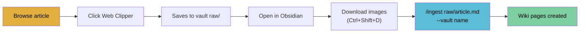

# Obsidian Web Clipper Setup & Workflow

How to clip web articles into your vault for ingestion.



## Install the Extension

1. Install [Obsidian Web Clipper](https://obsidian.md/clipper) for your browser (Chrome, Firefox, Safari, Edge)
2. Open the extension settings and connect it to your Obsidian vault

## Configure Obsidian Settings

### Set Attachment Folder

In Obsidian:
1. **Settings** → **Files and links**
2. Set **"Default location for new attachments"** → **"In subfolder under current folder"** or **"In the folder specified below"**
3. Set the path to: `raw/assets`

This ensures downloaded images go to `raw/assets/` in your vault.

### Set Up Image Download Hotkey

1. **Settings** → **Hotkeys**
2. Search for **"Download all remote images"** (requires the [Local Images Plus](https://github.com/catalystsquad/obsidian-local-images-plus) community plugin)
3. Bind to a hotkey, e.g. `Ctrl+Shift+D` / `Cmd+Shift+D`

Alternative: The [Obsidian Local Images](https://github.com/catalystsquad/obsidian-local-images-plus) plugin can auto-download images on paste.

### Configure Web Clipper Output

In the Web Clipper extension settings:
1. Set **"Folder"** to: `raw` (saves clipped articles directly to your vault's raw/ folder)
2. Set **"File name template"** to: `{{title|slugify}}` (creates kebab-case filenames)
3. Enable **"Include metadata"** (adds source URL, author, date to frontmatter)

## Daily Workflow

### 1. Clip an Article

While reading a web article:
1. Click the Obsidian Web Clipper extension icon
2. Select your vault (the one you want to ingest into)
3. Verify the folder is `raw/`
4. Click **"Add to Obsidian"**

The article is saved as markdown in your vault's `raw/` directory.

### 2. Download Images

Open the newly clipped file in Obsidian:
1. Press your download hotkey (`Ctrl+Shift+D`)
2. Images are downloaded to `raw/assets/`
3. Image links in the markdown are updated to local paths

### 3. Ingest into Wiki

In Claude Code:
```
/ingest raw/<article-slug>.md --vault my-research
```

Claude reads the clipped article, creates wiki pages (source-note, entities, concepts), updates the index, and commits.

## Tips

- **Clip first, ingest later.** Build up a batch of articles in `raw/`, then ingest them one at a time with Claude.
- **Review before ingesting.** Open the clipped article in Obsidian first. Check if the content extracted cleanly. Some sites clip poorly (paywalled content, heavy JS).
- **The raw file is immutable.** Once in `raw/`, don't edit the source article. The wiki pages in `wiki/` are where Claude maintains and updates the knowledge.
- **Downloading images matters.** Remote image URLs break over time. Local images let Claude view them directly for additional context.

## Recommended Obsidian Plugins for This Workflow

| Plugin | Purpose |
|--------|---------|
| [Local Images Plus](https://github.com/catalystsquad/obsidian-local-images-plus) | Download remote images to local |
| [Dataview](https://github.com/blacksmithgu/obsidian-dataview) | Query wiki pages by frontmatter |
| [Graph View](built-in) | Visualize wiki connections |
| [Marp Slides](https://github.com/samuele-cozzi/obsidian-marp-slides) | View generated slide decks |

## Troubleshooting

- **Clipper saves to wrong folder**: Check the extension's folder setting is `raw`, not the vault root
- **Images not downloading**: Ensure Local Images Plus plugin is installed and enabled
- **Poor extraction quality**: Some sites (SPAs, paywalled) clip poorly. Use the browser's Reader Mode first, then clip
- **Frontmatter conflicts**: If the clipped article already has YAML frontmatter, the ingest skill will merge it with the wiki-templates frontmatter
