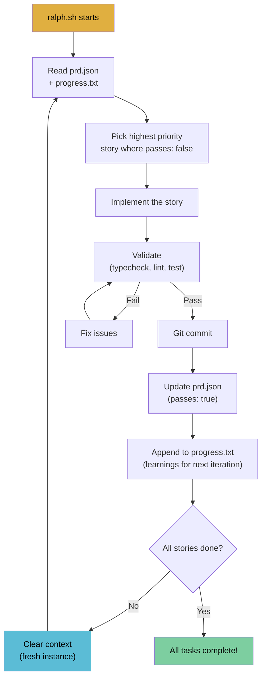

# Ralph Loop Research

## What is the Ralph Loop?



The Ralph Loop (aka Ralph Wiggum technique) is an autonomous AI coding pattern. Named after Ralph Wiggum from The Simpsons — lovable but forgetful, which mirrors how AI agents behave without persistent memory.

**Core concept is shockingly simple:**

```bash
while :; do cat PROMPT.md | claude-code ; done
```

A bash loop that repeatedly spawns fresh AI agent instances. Each iteration gets a clean context window. Memory persists only through files on disk (git history, progress files, PRD documents).

## Origins

- **Created by:** Geoffrey Huntley (Australian open-source dev), ~May 2025
- **Popularized by:** Matt Pocock (TypeScript educator, aihero.dev) and Ryan Carson (CEO, GitHub: snarktank), late December 2025
- **VentureBeat coverage:** "How Ralph Wiggum went from The Simpsons to the biggest name in AI right now"

## How It Works

### Phase 1: Define Requirements
- Human + LLM produce a PRD (Product Requirements Document)
- Break work into user stories, each small enough for one context window
- Matt Pocock uses `/write-a-prd` and `/grill-me` skills for this

### Phase 2: The Ralph Loop
Each iteration:
1. **Orient** — agent reads specs/requirements
2. **Read plan** — studies `prd.json` or `IMPLEMENTATION_PLAN.md`
3. **Select** — picks highest priority incomplete task
4. **Investigate** — explores relevant source code
5. **Implement** — makes code changes
6. **Validate** — runs tests, typechecks, linting ("backpressure")
7. **Update plan** — marks task done, notes discoveries
8. **Update learnings** — records operational patterns for future iterations
9. **Commit** — git commit with passing checks
10. **Loop ends** — context cleared, next iteration starts fresh

### Key Files

| File | Purpose |
|------|---------|
| `ralph.sh` | The bash loop script |
| `CLAUDE.md` / `prompt.md` | Prompt fed to agent each iteration |
| `prd.json` | User stories with completion status (`passes: true/false`) |
| `progress.txt` | Append-only learnings for future iterations |
| `AGENTS.md` | Operational guide read automatically |

## Matt Pocock's Workflow

```
Idea -> /write-a-prd -> PRD -> /prd-to-issues -> Kanban Board -> ralph.sh -> Ralph Loop -> Manual QA
```

### His 11 Key Tips

1. **Start HITL, then go AFK** — watch Ralph work before letting it run unsupervised
2. **Define scope as end state** — not implementation steps
3. **Track progress** via `progress.txt` committed to repo
4. **Use feedback loops** — types, tests, linting must pass before commits ("backpressure")
5. **Take small steps** — each PRD item should fit in one context window
6. **Prioritize risky tasks first** — architectural decisions before UI polish
7. **Explicitly define quality expectations** — "Agents amplify what they see. Poor code leads to poorer code"
8. **Use Docker sandboxes** — essential for AFK Ralph
9. **Make it your own** — test coverage loops, duplication loops, linting loops
10. **Tune it like a guitar** — observe failures, add guardrails reactively
11. **Multi-phase plans are dead** — define end state, not steps

### His Tools
- **Claude Code CLI**
- **Docker Desktop 4.50+** for sandboxed execution
- **Skills repo**: github.com/mattpocock/skills (write-a-prd, prd-to-plan, prd-to-issues, grill-me, tdd, etc.)
- **Sandcastle**: github.com/mattpocock/sandcastle (TypeScript lib for orchestrating sandboxed agents)

## Ryan Carson (Snarktank)

- **Main repo:** github.com/snarktank/ralph (15,861 stars)
- **ai-dev-tasks repo:** github.com/snarktank/ai-dev-tasks (7,675 stars)
- Runs **three parallel Ralph instances** on separate feature branches simultaneously
- His implementation supports both **Amp** (default) and **Claude Code**
- His article got **690,000+ views**

### Snarktank's Key Additions
- Auto-archiving previous runs when branch changes
- `<promise>COMPLETE</promise>` stop signal when all stories pass
- prd.json format with user stories, acceptance criteria, priority ordering
- Story sizing: "If you cannot describe the change in 2-3 sentences, it is too big"
- Dependency ordering: schema -> backend -> UI

## Key Quotes

- Geoffrey Huntley: *"Sit on the loop, not in it"*
- Matt Pocock: *"There's an AI coding approach that lets you run seriously long-running AI agents (hours, days) that ship code while you sleep. I've tried it, and I'm not going back."*
- Matt Pocock: *"Agents amplify what they see. Poor code leads to poorer code."*
- Matt Pocock: *"Tune it like a guitar"*
- Ryan Carson: *"Living the dream. Three instances of Ralph using Amp, building three separate features, on three branches."*

## Key Resources

### Videos
- Matt Pocock's Ralph Overview: youtube.com/watch?v=_IK18goX4X8
- Geoffrey Huntley Deep Dive: youtube.com/watch?v=SB6cO97tfiY
- "AI That Works" Podcast (75 min): youtube.com/watch?v=fOPvAPdqgPo

### Articles
- Geoffrey Huntley original: ghuntley.com/ralph/
- "Everything is a Ralph Loop": ghuntley.com/loop/
- "Don't Waste Your Back Pressure": ghuntley.com/pressure/
- Matt Pocock - Getting Started: aihero.dev/getting-started-with-ralph
- Matt Pocock - 11 Tips: aihero.dev/tips-for-ai-coding-with-ralph-wiggum

### Repos (cloned in .reference/)
- **mattpocock/skills** — his Claude Code skills collection
- **snarktank/ralph** — the most popular standalone implementation
- Also: ghuntley/how-to-ralph-wiggum, ClaytonFarr/ralph-playbook, snwfdhmp/awesome-ralph

### Community
- Subreddit: reddit.com/r/RalphCoding/
- Discord: discord.gg/MUyRMqKcWx

## Relevance to LLM Wiki

The Ralph Loop pattern is relevant to our project in two ways:

1. **Build methodology** — we could use a Ralph loop to build the llm-wiki itself (Next.js app, skills, etc.)
2. **Wiki operations as a loop** — the ingest/lint operations could run as a Ralph-style loop: process sources one at a time, each in a fresh context, with progress tracked in the wiki's own log.md
