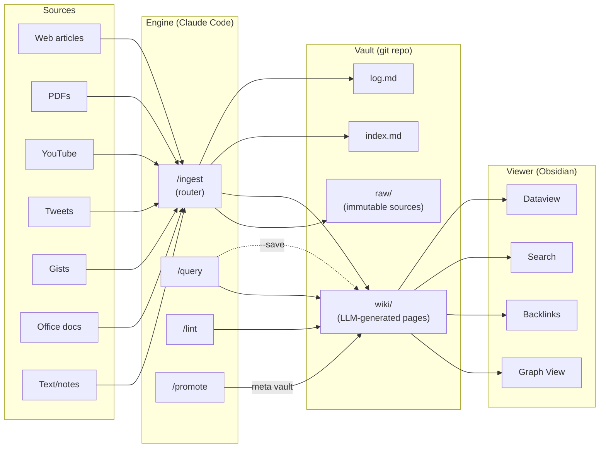

# LLM Wiki — Roadmap

## Overview

```mermaid
graph TB
    subgraph "Phase 0: Foundation ✅"
        P0A[Git repo + GitHub] --> P0B[Ralph loop skill]
        P0B --> P0C[Setup skill]
        P0C --> P0D[Docs: workflow, deps]
        P0D --> P0E[PRD for Phase 1]
    end

    subgraph "Phase 1: Vault Engine ✅"
        P1A["/vault-create"] --> P1B["/vault-status"]
        P1B --> P1C["wiki-templates<br/>(5 page types)"]
        P1C --> P1D["/ingest router"]
        P1D --> P1E["7 ingest sub-skills<br/>(web, PDF, Office, YouTube,<br/>tweet, gist, text)"]
        P1E --> P1F["/query + --save"]
        P1F --> P1G["/lint + --fix"]
        P1G --> P1H["/promote"]
    end

    subgraph "Phase 1.5: Import & Private 🔧"
        P15A["/vault-import"] --> P15B[".private/ overlay"]
    end

    subgraph "Phase 2: Tooling 📋"
        P2A["qmd search<br/>(/search)"] --> P2B["Obsidian Web Clipper<br/>workflow"]
        P2B --> P2C["Marp slides<br/>(/slides)"]
        P2C --> P2D["Image handling<br/>(local download)"]
        P2D --> P2E["Dataview<br/>compatibility"]
    end

    subgraph "Phase 3: Local Web App 📋"
        P3A["Next.js scaffold<br/>(pnpm, TS, shadcn)"] --> P3B["API routes<br/>(ingest, query, browse)"]
        P3B --> P3C["Dashboard UI<br/>(vault overview)"]
        P3C --> P3D["Chat interface<br/>(query via browser)"]
        P3D --> P3E["PWA<br/>(mobile install)"]
    end

    subgraph "Phase 4: Deployment 📋"
        P4A["Dockerfile"] --> P4B["docker-compose<br/>(Caddy + Watchtower)"]
        P4B --> P4C["GitHub Actions CI<br/>(build → GHCR)"]
        P4C --> P4D["Hetzner VPS<br/>auto-deploy"]
        P4D --> P4E["Backups<br/>(restic → B2)"]
        P4E --> P4F["Plausible/Umami<br/>analytics"]
    end

    subgraph "Phase 5: SaaS 📋"
        P5A["Auth<br/>(Clerk or Better Auth)"] --> P5B["Stripe billing"]
        P5B --> P5C["Multi-tenant vaults"]
        P5C --> P5D["GitHub sync<br/>(optional)"]
        P5D --> P5E["Vault export<br/>(no lock-in)"]
    end

    P0E --> P1A
    P1H --> P15A
    P15B --> P2A
    P2E --> P3A
    P3E --> P4A
    P4F --> P5A

    style P0A fill:#22c55e,color:#000
    style P0B fill:#22c55e,color:#000
    style P0C fill:#22c55e,color:#000
    style P0D fill:#22c55e,color:#000
    style P0E fill:#22c55e,color:#000
    style P1A fill:#22c55e,color:#000
    style P1B fill:#22c55e,color:#000
    style P1C fill:#22c55e,color:#000
    style P1D fill:#22c55e,color:#000
    style P1E fill:#22c55e,color:#000
    style P1F fill:#22c55e,color:#000
    style P1G fill:#22c55e,color:#000
    style P1H fill:#22c55e,color:#000
    style P15A fill:#22c55e,color:#000
    style P15B fill:#22c55e,color:#000
    style P2A fill:#fbbf24,color:#000
    style P2B fill:#fbbf24,color:#000
    style P2C fill:#fbbf24,color:#000
    style P2D fill:#fbbf24,color:#000
    style P2E fill:#fbbf24,color:#000
    style P3A fill:#94a3b8,color:#000
    style P3B fill:#94a3b8,color:#000
    style P3C fill:#94a3b8,color:#000
    style P3D fill:#94a3b8,color:#000
    style P3E fill:#94a3b8,color:#000
    style P4A fill:#94a3b8,color:#000
    style P4B fill:#94a3b8,color:#000
    style P4C fill:#94a3b8,color:#000
    style P4D fill:#94a3b8,color:#000
    style P4E fill:#94a3b8,color:#000
    style P4F fill:#94a3b8,color:#000
    style P5A fill:#94a3b8,color:#000
    style P5B fill:#94a3b8,color:#000
    style P5C fill:#94a3b8,color:#000
    style P5D fill:#94a3b8,color:#000
    style P5E fill:#94a3b8,color:#000
```

**Legend:** 🟢 Complete | 🟡 Next up (MVP) | ⬜ Future (optional)

**MVP = Phase 0 + Phase 1 + Phase 2.** Everything after Phase 2 is optional future work.

---

## Phase 0: Foundation ✅

Git init, tooling, ralph loop, docs. **Complete.**

| Item | Status | Details |
|------|--------|---------|
| Git repo + GitHub | ✅ | Public at github.com/RonanCodes/llm-wiki |
| Ralph loop skill | ✅ | `/ralph` + `ralph.sh` for autonomous builds |
| Setup skill | ✅ | `/setup` for first-time bootstrap |
| Workflow docs | ✅ | `docs/workflow.md`, `docs/dependencies.md` |
| PRD generation | ✅ | `prd.json` with 8 user stories |

---

## Phase 1: Vault Engine ✅

Core vault system — all Claude Code skills. **Complete. 20 skills built.**

| Skill | Status | What it does |
|-------|--------|-------------|
| `/vault-create` | ✅ | Scaffold vault with structure, index, log, CLAUDE.md, git init |
| `/vault-status` | ✅ | List all vaults with page counts, sources, last activity, git status |
| `/vault-import` | ✅ | Import existing Obsidian vault or markdown folder |
| `wiki-templates` | ✅ | 5 page types with full frontmatter specs (auto-loaded) |
| `/ingest` | ✅ | Router — detects source type, delegates to sub-skill |
| `ingest-web` | ✅ | URL → markdown (zero deps) |
| `ingest-pdf` | ✅ | PDF → text (lazy: poppler) |
| `ingest-office` | ✅ | Word/Excel/PPT → text (lazy: pandoc) |
| `ingest-youtube` | ✅ | YouTube → transcript (lazy: yt-dlp) |
| `ingest-tweet` | ✅ | Tweet → text via FXTwitter API (zero deps) |
| `ingest-gist` | ✅ | Gist → text via raw URL (zero deps) |
| `ingest-text` | ✅ | Pasted text or local markdown (zero deps) |
| `/query` | ✅ | Ask questions, synthesize answers with citations, `--save` to wiki |
| `/lint` | ✅ | 8 check categories, `--fix` auto-repair, severity-grouped report |
| `/promote` | ✅ | Graduate reusable knowledge between vaults |
| `.private/` overlay | ✅ | Private skills/config, gitignored, own git repo |

**Also built (utilities):**
| Skill | What it does |
|-------|-------------|
| `/read-tweet` | Quick tweet reader (standalone) |
| `/read-gist` | Quick gist reader (standalone) |
| `/yt-transcript` | YouTube transcript extractor (standalone) |
| `/create-skill` | Meta-skill for creating new skills |
| `/ralph` | Autonomous build loop |
| `/setup` | First-time machine bootstrap |

---

## Phase 2: Tooling 📋 **Next up — completes the MVP**

Wire up ecosystem tools from Karpathy's recommendations. PRD: `prd.json` (US-009 through US-013).

| Item | Story | Status | Details |
|------|-------|--------|---------|
| qmd search | US-009 | 📋 | `/search` — hybrid BM25/vector search for wiki pages |
| Obsidian Web Clipper | US-010 | 📋 | Workflow doc + integration for clipping articles → raw/ |
| Marp slides | US-011 | 📋 | `/slides` — generate presentations from wiki content |
| Image handling | US-012 | 📋 | Download images locally during ingest |
| Dataview compat | US-013 | 📋 | Ensure frontmatter works with Dataview queries + example queries |

---

## Future Phases (optional, not MVP)

Everything below is stretch / future work. The system is fully usable after Phase 2.

### Phase 3: Local Web App 📋

Next.js companion app — a nice UI for vault management, chat interface, and mobile access. Not needed for power users on CLI + Obsidian, but great for DX and onboarding.

| Item | Details |
|------|---------|
| Next.js scaffold | pnpm, TypeScript, Tailwind, shadcn/ui, Turbopack |
| API routes | `/api/ingest`, `/api/query`, `/api/vaults`, `/api/capture` |
| Dashboard | Vault overview, recent activity |
| Chat interface | Query vaults conversationally from browser |
| PWA | Installable on mobile, works offline |
| Obsidian launcher | Button to open vault in Obsidian |

**Tech stack:** Next.js App Router, shadcn/ui, Drizzle (SQLite local / Postgres SaaS), ESLint + Prettier, Vitest

### Phase 4: Deployment 📋

Self-hosted on Hetzner VPS with auto-deploy.

| Item | Details |
|------|---------|
| Dockerfile | Multi-stage build, Next.js standalone output |
| docker-compose | App + Caddy (auto HTTPS) + Watchtower (auto-deploy) |
| GitHub Actions CI | Build image → push to GHCR on main push |
| Hetzner VPS | Watchtower detects new image → auto-redeploys |
| Backups | restic/borgmatic → Backblaze B2 on cron |
| Analytics | Self-hosted Plausible or Umami |
| Email | Resend API for transactional email |

### Phase 5: SaaS 📋

Multi-tenant hosted version. Same codebase, different deployment.

| Item | Details |
|------|---------|
| Auth | Clerk (speed) or Better Auth (ownership) — TBD |
| Stripe billing | BYO key ~$10/mo, all-in ~$30-50/mo |
| Multi-tenant vaults | Per-user storage (S3 or namespaced filesystem) |
| GitHub sync | Optional — user connects GitHub, vaults auto-push |
| Vault export | Always available — no lock-in (it's just markdown) |

---

## Architecture Flow

---

## Key Metrics

| Metric | Current |
|--------|---------|
| Skills built | 20 |
| Source types supported | 7 |
| Core operations | 4 (ingest, query, lint, promote) |
| Wiki page types | 5 (source-note, entity, concept, comparison, summary) |
| External deps (core) | 0 (curl only for zero-dep skills) |
| External deps (optional) | 5 (yt-dlp, poppler, pandoc, qmd, marp) |
