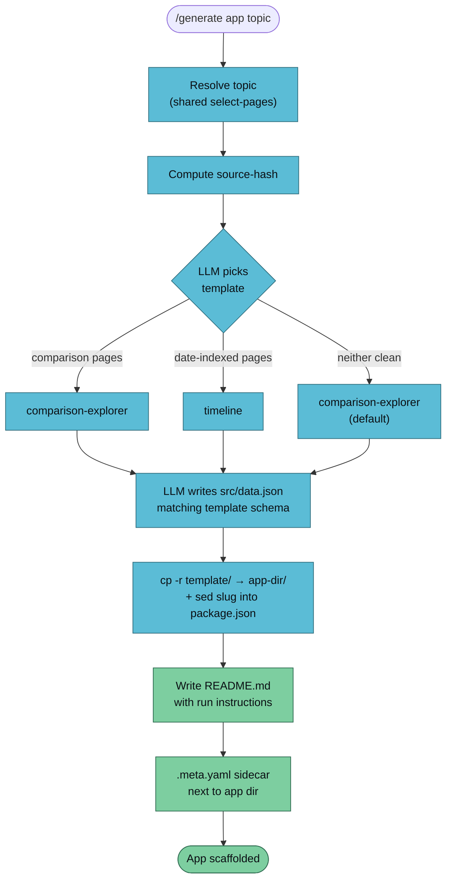

`/generate app` scaffolds a **runnable Vite + React + TypeScript app** populated with structured data the LLM extracts from wiki pages. Output is a directory you `pnpm install` and `pnpm dev` locally. Two templates ship: **comparison-explorer** and **timeline**.



## Usage

```
/generate app <topic> [--vault <name>] [--template <name>]
```

| Flag | Default | Notes |
|------|---------|-------|
| `--template` | LLM auto-picks | Force `comparison-explorer` or `timeline` |

## Example

```bash
/generate app "inference servers" --vault llm-wiki-research
```

```
✅ App scaffolded
   Topic:       inference servers
   Template:    comparison-explorer
   Entries:     7
   Source hash: 2dd9ed4a003f

   Directory:   vaults/llm-wiki-research/artifacts/app/inference-servers-2026-04-18/
   Sidecar:     vaults/llm-wiki-research/artifacts/app/inference-servers-2026-04-18.meta.yaml

   Run:
     cd vaults/llm-wiki-research/artifacts/app/inference-servers-2026-04-18
     pnpm install
     pnpm dev
```

The sidecar sits **next to** the app directory — so the directory itself stays a clean Vite project with no stray YAML.

## Template Gallery

### comparison-explorer

A filterable card grid. One card per item; per-column chip filters at the top; full-text search across name/summary/values.

Good for: feature matrices, "X vs Y" pages, tool shootouts.

**Data shape:**

```json
{
  "title": "LLM Inference Servers — Comparison",
  "columns": [
    { "key": "throughput", "label": "Throughput" },
    { "key": "license",    "label": "License"    }
  ],
  "rows": [
    {
      "name": "vLLM",
      "source": "wiki/concepts/vllm.md",
      "values": { "throughput": "high", "license": "Apache-2.0" },
      "summary": "PagedAttention-based server. Strong concurrent throughput."
    }
  ]
}
```

### timeline

A vertical chronological event list, sort-direction toggle, tag chips, search. Dates sort lexically so `YYYY`, `YYYY-MM`, and `YYYY-MM-DD` can mix.

Good for: paper chronology, release history, decision logs, learning journals.

**Data shape:**

```json
{
  "title": "LLM Scaling — A Timeline",
  "events": [
    {
      "date": "2017-06",
      "title": "Attention Is All You Need",
      "source": "wiki/papers/attention-is-all-you-need.md",
      "summary": "Vaswani et al. introduce the Transformer architecture.",
      "tags": ["architecture", "paper"]
    }
  ]
}
```

## Authoring a Custom Template

Every template is a **normal Vite + React project** — no magic. To add one:

1. `cp -r templates/comparison-explorer templates/<your-template>`
2. Rewrite `src/App.tsx` for the new shape.
3. Drop a `src/data.schema.json` documenting the data shape.
4. Seed `src/data.json` with a placeholder.
5. Write a short `TEMPLATE.md` at the template root.

The scaffolder literally does `cp -r` + writes `data.json`. Any valid Vite project can become a template.

**Vault-local override:** `<vault>/.templates/app/<template-name>/` wins over the shipped default.

### Template guidelines

- **Single-file component preferred.** `App.tsx` is the whole app for both shipped templates.
- **Observatory palette** in `:root` CSS custom properties (`--amber #e0af40`, `--cyan #5bbcd6`, `--green #7dcea0`, `--bg #0b0f14`, `--text #e8eef6`).
- **Vanilla CSS, no frameworks.** Tailwind would mean extra install steps and version churn.
- **Data-driven only.** Zero business logic in the template — everything comes from `data.json`.
- **No router, no state lib.** If you need multi-page nav, the app is too big for this scaffolder.

## Why data.json + static template

The **only** LLM-authored output that varies per generation is `src/data.json`. Template code (`App.tsx`, CSS) is 100% static. That keeps the LLM's authoring surface small — author structured data, not React components.

Consequence: the "LLM writes broken React" failure mode goes away. Same principle as `generate-quiz`'s `questions.json` + static `quiz.html`.

## Dependencies

| Tool | Install | Purpose |
|------|---------|---------|
| Node 18+ | `brew install node` | Vite 5 runtime |
| `pnpm` | `npm i -g pnpm` | Package install + dev server |

Scaffolding doesn't run `pnpm install` for you — left to the user to touch their shell's package graph when they're ready.

## Troubleshooting

| Symptom | Cause | Fix |
|---------|-------|-----|
| `pnpm dev` errors on data import | `src/data.json` doesn't match the schema | Run against `src/data.schema.json` with a validator, fix the delta |
| "Source" links 404 inside the app | App dir not nested at `artifacts/app/<slug>/` | Relative paths in the JSX assume that depth — adjust if you relocate |
| `pnpm install` very slow first time | Clean pnpm store | Expected — second install is warm |
| Dates sort in the wrong order (timeline) | Mixing `YYYY` with `YYYY-MM-DD` | Lexical sort puts `2024` before `2024-01-15` — use one granularity throughout |

## Known Limitations (Phase 2D)

- **Two templates only.** Adding more is ~30 lines of template code each — shipped when the need is real.
- **Vite + React only.** No Astro/Next/Svelte variants.
- **Requires `pnpm install`.** It's a dev project, not a single-file artifact. For a shareable single-file output, `pnpm build` produces a static `dist/` you can host anywhere.
- **LLM template-pick accuracy varies.** When the topic doesn't obviously fit either template, it defaults to `comparison-explorer` and notes the uncertainty in the meta sidecar.

## See Also

- [/generate overview](./generate) — the router
- [generate-quiz](./generate-quiz) — single-file HTML sibling
- [generate-flashcards](./generate-flashcards) — Anki sibling
- [Artifact conventions](../../reference/artifacts) — sidecar schema
