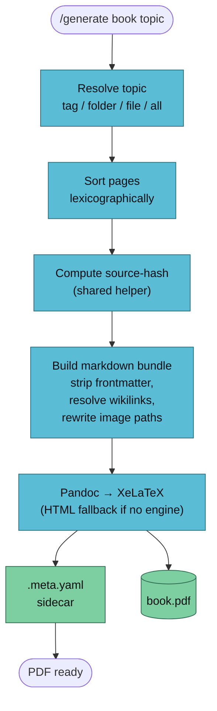

`/generate book` concatenates wiki pages into a book-format PDF: title page, auto-generated table of contents, chapter-per-page, preserved cross-references.



## Usage

```
/generate book <topic> [--vault <name>] [--no-toc] [--template <name>]
```

`<topic>` can be:

| Form | Meaning | Example |
|------|---------|---------|
| Tag | All pages with this tag in frontmatter | `attention` |
| Folder | All `.md` in this wiki folder | `concepts/rag` |
| File | A single wiki page | `wiki/concepts/attention.md` |
| `all` | Every `.md` under `wiki/` except `index.md` / `log.md` | `all` |

## Example

```bash
/generate book transformers --vault llm-wiki-research
```

Output:

```
✅ Book generated
   Topic:       transformers
   Pages in:    8 (sorted)
   Source hash: 2dd9ed4a003f
   Output:      vaults/llm-wiki-research/artifacts/book/transformers-2026-04-17.pdf
   Sidecar:     vaults/llm-wiki-research/artifacts/book/transformers-2026-04-17.meta.yaml
   Open with:   open vaults/llm-wiki-research/artifacts/book/transformers-2026-04-17.pdf
```

The sidecar captures everything needed to re-generate deterministically:

```yaml
generator: generate-book@0.1.0
generated-at: 2026-04-17T06:10:00Z
template: book-default
topic: "transformers"
flags:
  toc: true
generated-from:
  - vaults/llm-wiki-research/wiki/concepts/attention.md
  - vaults/llm-wiki-research/wiki/concepts/self-attention.md
  - vaults/llm-wiki-research/wiki/entities/transformer.md
source-hash: 2dd9ed4a003f9a778453f3b5a091b86a7580cf6a4befe648bf12f6535d958432
```

## Dependencies

Lazy-installed on first run:

| Tool | Install | Purpose |
|------|---------|---------|
| `pandoc` | `brew install pandoc` (macOS) / `apt install pandoc` | Markdown → LaTeX / HTML |
| XeLaTeX | `brew install --cask basictex` (~100MB) / `apt install texlive-xetex` | PDF engine |

If no LaTeX engine is available, `/generate book` falls back to HTML output and tells you how to install one. The handler does not hard-fail on a missing engine.

## Customisation

### Override the template

```bash
# Start from Pandoc's default book template
pandoc -D latex > book.tex

# Save to the skill's templates folder
mv book.tex .claude/skills/generate-book/templates/book.tex

# Edit to taste — custom fonts, cover page, headers
```

The handler auto-detects the template file and passes it to Pandoc via `--template`.

### Skip the TOC

```bash
/generate book all --no-toc
```

### Flags that will land in later phases

- `--include-mermaid` — render mermaid code blocks to PNG via `mermaid-cli` (Phase 2B)
- `--hyperref` — convert `[[wikilink]]` to clickable internal PDF anchors (Phase 2B)
- `--cover <image.png>` — custom cover art (Phase 2B)

## Known Limitations (Phase 2A)

- **Mermaid diagrams** render as fenced code blocks, not images. Readable, not pretty. Phase 2B fixes this.
- **Wikilinks** render as *italic inline text* rather than clickable anchors.
- **Cross-vault references** aren't resolved — `[[other-vault:page]]` isn't a thing yet.

## How Wikilinks Are Resolved

```
Source:    See [[attention]] for the foundational idea.
Rendered:  See *attention* for the foundational idea.
```

```
Source:    As the [[transformer|original paper]] explains…
Rendered:  As the *original paper* explains…
```

A sed pass runs before Pandoc — it never sees the `[[...]]` syntax.

## Pandoc Errors

If Pandoc fails (missing LaTeX package, unicode glyph, etc.) the skill tails the last 20 lines of stderr and suggests the common fix:

```
pandoc failed. Last 20 lines of stderr:
  ! Undefined control sequence.
  l.142 \textbeta

Common fixes:
  - Missing LaTeX package:   tlmgr install <package>
  - Unicode error:           set PDF_ENGINE=xelatex
  - Image not found:         check relative paths in source pages
  - Font not found:          install font or drop -V mainfont=...
```

## See Also

- [/generate overview](./generate) — the router
- [generate-pdf](./generate-pdf) — the quick, no-ceremony sibling
- [Artifact conventions](../../reference/artifacts) — sidecar schema
- [Commands reference](../../reference/commands)
