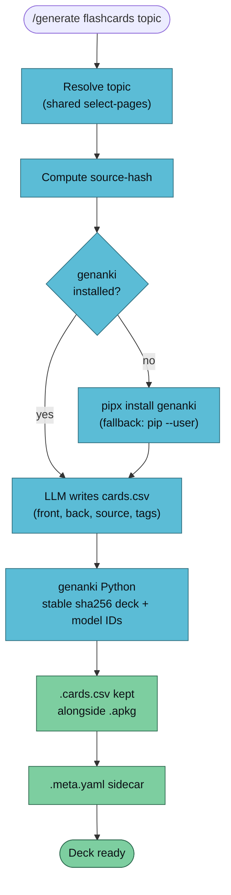

`/generate flashcards` produces an Anki `.apkg` deck from wiki pages — front/back card pairs, each tagged with the source wiki page. Import into Anki desktop, AnkiMobile, or AnkiDroid for spaced-repetition study. Re-renders update the deck in place (your review history survives).



## Usage

```
/generate flashcards <topic> [--vault <name>] [--count <n>] [--difficulty easy|medium|hard]
```

| Flag | Default | Notes |
|------|---------|-------|
| `--count` | `20` | Number of cards |
| `--difficulty` | `medium` | Nudges card style (see table below) |

### Difficulty calibration

| Level | Card style |
|-------|-----------|
| `easy` | Term ↔ definition, single fact |
| `medium` | Apply the concept to a scenario |
| `hard` | Compare two concepts, or derive an implication |

## Example

```bash
/generate flashcards transformers --vault llm-wiki-research --count 30
```

```
✅ Flashcards generated
   Topic:       transformers
   Deck:        llm-wiki::llm-wiki-research::transformers
   Cards:       30
   Difficulty:  medium
   Source hash: 2dd9ed4a003f
   APKG:        vaults/llm-wiki-research/artifacts/flashcards/transformers-2026-04-18.apkg
   CSV:         vaults/llm-wiki-research/artifacts/flashcards/transformers-2026-04-18.cards.csv
   Sidecar:     vaults/llm-wiki-research/artifacts/flashcards/transformers-2026-04-18.meta.yaml

   Import:      Anki → File → Import → select the .apkg
   Mobile:      AirDrop / share the .apkg to AnkiMobile / AnkiDroid
```

## Importing into Anki

**Desktop:** `File → Import…` → pick the `.apkg`. Anki creates (or updates) the `llm-wiki::<vault>::<topic>` deck. The `::` separator is Anki's hierarchical folder convention — keeps the sidebar tidy as you accumulate decks.

**AnkiMobile / AnkiDroid:** AirDrop / share-sheet the `.apkg` to the mobile app. Same update-in-place behaviour.

**Second render, same topic:** Stable deck + model IDs mean Anki updates existing cards and adds new ones. Your review scheduling history survives across regenerations.

## The `.cards.csv` Artifact

The re-renderable source alongside the `.apkg`:

```csv
front,back,source,tags
"What is attention in transformers?","A mechanism that computes a weighted sum over all tokens in a sequence, letting each position directly attend to every other.","wiki/concepts/attention.md","transformers attention"
"Why is self-attention O(n²)?","Because it computes pairwise scores between all token pairs — cost grows quadratically with sequence length.","wiki/concepts/self-attention.md","transformers attention scaling"
```

Why CSV over JSON:

- Anki's own import path is CSV-native.
- `awk` / `cut` / diff-friendly — readable in a commit.
- Plain text maps cleanly to the 99%-text nature of flashcard content.

Phase 2E's `verify-artifact` re-ingests this CSV (not the `.apkg`, which is SQLite) to check each card against its source page.

## Card-writing rules

The LLM follows a fixed contract:

- **One idea per card.** Atomic facts — split compound facts across multiple cards.
- **`source` is mandatory** — rendered in the card footer at review time.
- **Tags** always include the vault name and topic; optionally add concept tags.
- **RFC 4180 quoting** — embedded `"` becomes `""`.

## Stable Deck IDs

Deck and model IDs are **deterministic sha256 hashes** of the deck name and a model version string:

```python
deck_id  = int(hashlib.sha256(deck_name.encode()).hexdigest()[:8], 16) & 0x7fffffff
model_id = int(hashlib.sha256(b"llm-wiki-basic-v1").hexdigest()[:8], 16) & 0x7fffffff
```

- Same `deck_name` → same `deck_id` → Anki updates cards in place on re-import.
- Model ID is **versioned** (`v1`). When we add cloze cards later (v2), existing decks won't clobber.
- Random IDs would create a duplicate deck on every render — painful UX.

## Dependencies

Lazy-installed on first run:

| Tool | Install | Purpose |
|------|---------|---------|
| `genanki` | `pipx install genanki` (fallback: `pip install --user`) | Build the `.apkg` |

No local Anki install required to *generate* the file — `.apkg` is just a SQLite blob Anki reads at import time.

## Troubleshooting

| Symptom | Cause | Fix |
|---------|-------|-----|
| "genanki not found" after install | pipx bin dir not on `PATH` | `pipx ensurepath` then restart shell |
| Duplicate deck appears on re-import | Deck name changed | Stable IDs key off the deck name — rename-proofing is intentional. Use the old name to update in place |
| Cards all tagged identically | LLM didn't emit per-card tags | Edit the CSV and re-run; the `vault` tag is auto-added either way |
| Source link in card footer is broken | Card is being reviewed outside a wiki context | The footer shows the path, not a live link — that's the design |

## Known Limitations (Phase 2D)

- **Basic (front/back) only.** No cloze-deletion cards yet. Model-ID versioning leaves room.
- **No media support.** Text-only cards. Adding image/audio is deferred.
- **Card quality tracks wiki quality.** Sparse pages → repetitive cards.
- **CSV must be RFC 4180 valid.** The LLM is instructed — review if you edit manually.

## See Also

- [/generate overview](./generate) — the router
- [generate-quiz](./generate-quiz) — one-shot self-test sibling
- [genanki](https://github.com/kerrickstaley/genanki) — the upstream library
- [Artifact conventions](../../reference/artifacts) — sidecar schema
