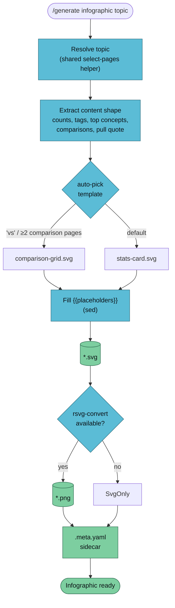

`/generate infographic` produces a single-page SVG summary of a topic, styled to the Observatory palette (amber, cyan, green). The handler picks a template based on the shape of the content — counts vs. comparisons vs. timeline — and fills its `{{placeholder}}` slots.



## Usage

```
/generate infographic <topic> [--vault <name>] [--template <name>] [--no-png]
```

## Example

```bash
/generate infographic "rag vs fine-tuning" --vault llm-wiki-research
```

Because the topic contains "vs", the handler picks `comparison-grid`:

```
✅ Infographic generated
   Topic:       rag vs fine-tuning
   Template:    comparison-grid
   Pages in:    4 (sorted)
   Source hash: c9f1a8d4b622
   SVG:         vaults/llm-wiki-research/artifacts/infographic/rag-vs-fine-tuning-2026-04-18.svg
   PNG:         vaults/llm-wiki-research/artifacts/infographic/rag-vs-fine-tuning-2026-04-18.png
   Sidecar:     vaults/llm-wiki-research/artifacts/infographic/rag-vs-fine-tuning-2026-04-18.meta.yaml
```

## Template Auto-Pick Rule

| Rule | Template |
|------|----------|
| Topic contains `vs` / `versus` OR ≥ 2 comparison pages | `comparison-grid` |
| Timeline-like dates in ≥ 3 pages | `timeline` *(deferred)* |
| Otherwise | `stats-card` (default) |

Override with `--template <name>`.

## Shipped Templates

### `stats-card` — 1600×900

Top-line counts, tag cloud, pull-quote panel. Good for vault summaries and "state of…" posts.

Placeholders: `{{title}} {{date}} {{page_count}} {{tag_count}} {{top_concept_1..3}} {{tag_strip}} {{pull_quote}} {{pull_quote_source}} {{vault_name}}`

### `comparison-grid` — 1600×1000

Two-column compare with 4 dimension rows and a verdict band. Left column cyan, right green, verdict amber.

Placeholders: `{{title}} {{left_name}} {{right_name}} {{dim_1..4_label}} {{dim_1..4_left}} {{dim_1..4_right}} {{verdict}} {{vault_name}}`

## Observatory Theme

All shipped templates use the project palette:

| Role | Colour | Usage |
|------|--------|-------|
| Amber | `#e0af40` | Source / heading / accent |
| Cyan | `#5bbcd6` | Engine / process / left-column |
| Green | `#7dcea0` | Output / positive / right-column |
| Background | `#0b0f14` | Dark panels |
| Text | `#e8eef6` | Body text on dark |

Templates that deviate must note why in a comment near the top.

## Dependencies

| Tool | Install | Purpose | Required? |
|------|---------|---------|-----------|
| `rsvg-convert` | `brew install librsvg` / `apt install librsvg2-bin` | SVG → PNG | Optional |

SVG alone is fine for web display — PNG is the better format for Twitter / LinkedIn cards. Pass `--no-png` to skip the PNG export.

## Authoring New Templates

1. Copy an existing template in `.claude/skills/generate-infographic/templates/` as a starting point.
2. Use `{{mustache}}` placeholders. Document each one in a `<!-- placeholders: ... -->` comment at the top.
3. Stay on the Observatory palette. If you deviate, document why.
4. **Use `<foreignObject>` with HTML inside** for any text that needs to wrap — pure `<text>` elements don't wrap.
5. Keep it single-page. Rule of thumb: readable at 1200px without zooming.
6. Optional: override export width with `<!-- export-width: 2400 -->` in the SVG header.
7. Add a screenshot to this doc once the template lands.

## Known Limitations (Phase 2B)

- **Only 2 templates shipped.** `timeline` is noted but deferred.
- **LLM-dependent slot-fill.** The handler relies on the invoking LLM reading pages and producing sensible values. No static parser. Quality varies with prompt.
- **Silent failures on bad data.** If the LLM emits empty strings or malformed fragments, the SVG still renders but looks wrong. Phase 2E's `verify-artifact` will validate SVG parses as XML.
- **Fixed per-template sizing.** Future: accept `--width` and scale.

## See Also

- [/generate overview](./generate) — the router
- [generate-slides](./generate-slides) — presentation sibling
- [generate-mindmap](./generate-mindmap) — tree sibling
- [Artifact conventions](../../reference/artifacts) — sidecar schema
