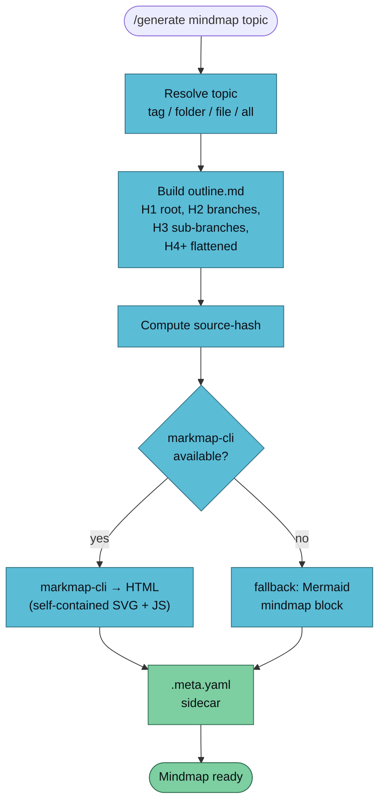

`/generate mindmap` turns wiki pages and their heading structure into an interactive mindmap. Output is a self-contained HTML file — no CDN, no hosting, pan and zoom in any browser.



## Usage

```
/generate mindmap <topic> [--vault <name>] [--include-wikilinks] [--template <name>]
```

## Example

```bash
/generate mindmap rag-patterns --vault llm-wiki-research
```

Output:

```
✅ Mindmap generated
   Topic:       rag-patterns
   Pages in:    6 (sorted)
   Source hash: 8f3a1d6be711
   Outline:     vaults/llm-wiki-research/artifacts/mindmap/rag-patterns-2026-04-18.outline.md
   HTML:        vaults/llm-wiki-research/artifacts/mindmap/rag-patterns-2026-04-18.html
   Sidecar:     vaults/llm-wiki-research/artifacts/mindmap/rag-patterns-2026-04-18.meta.yaml
   Open with:   open vaults/llm-wiki-research/artifacts/mindmap/rag-patterns-2026-04-18.html
```

The `.outline.md` is kept — it's the Markmap source, re-renderable and diffable.

## Outline Construction

| Wiki heading | Mindmap position |
|--------------|------------------|
| Page title (H1 of page) | Top branch under the topic root |
| H2 | Sub-branch |
| H3 | Sub-sub-branch |
| H4+ | Flattened into H3 as a bullet list |
| `[[wikilink]]` | Italic label; with `--include-wikilinks` adds a "Related" sub-branch |
| Page `.md` path | `[Source]()` leaf link per page |

## Dependencies

Lazy-installed on first run:

| Tool | Install | Purpose |
|------|---------|---------|
| `markmap-cli` | `pnpm add -g markmap-cli` (or `npm i -g`) | Markdown → mindmap HTML |

If the install fails (offline box, locked npm), the handler writes a Mermaid `mindmap` block to a plain `.md` file. You can paste it into Obsidian's Mermaid renderer, into GitHub, or anywhere else Mermaid is supported.

## Customisation

### The `markmap:` YAML block

The shipped template includes a non-standard `markmap:` YAML block that Markmap reads directly:

```yaml
markmap:
  colorFreezeLevel: 2
  maxWidth: 300
  initialExpandLevel: 2
  spacing: { vertical: 6, horizontal: 80 }
```

Tools other than markmap-cli ignore it.

### Vault-local override

Drop `<vault>/.templates/mindmap/default.md` to ship house-tuned spacing / colour-freeze-level per vault.

## Obsidian Embedding

The generated HTML is self-contained — works with the [HTML Reader](https://github.com/nuthrash/obsidian-html-plugin) plugin:

```md
## Mindmap

`$= "<iframe src='" + app.vault.adapter.getResourcePath('artifacts/mindmap/rag-patterns-2026-04-18.html') + "' width='100%' height='600'></iframe>"`
```

(That's a dataviewjs snippet — adjust the artifact path.)

## Known Limitations (Phase 2B)

- **Cross-file hyperlinks** between mindmaps aren't supported. Node-level links only work for external URLs or local file paths.
- **Wikilinks** render as italic labels — not clickable inside the mindmap. Use `--include-wikilinks` to surface them as a "Related" branch.
- **Mermaid fallback** is plain markdown — no interactive pan/zoom, but renders everywhere Mermaid renders.

## See Also

- [/generate overview](./generate) — the router
- [generate-slides](./generate-slides) — linear sibling
- [generate-infographic](./generate-infographic) — poster-style sibling
- [Artifact conventions](../../reference/artifacts) — sidecar schema
