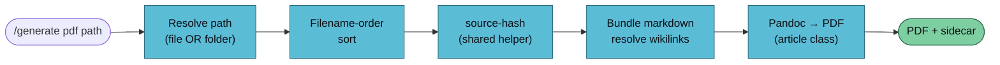

`/generate pdf` is the "print this page" of the artifact system. Point it at a wiki file or a folder and get a quick, shareable PDF — none of the book ceremony, same provenance contract.



## Usage

```
/generate pdf <path> [--vault <name>] [--toc] [--template <name>] [--recursive]
```

`<path>` is:

| Form | Meaning | Example |
|------|---------|---------|
| File | A single `.md` page | `wiki/concepts/attention.md` |
| Folder | All `.md` in that folder (non-recursive) | `concepts/rag/` |
| Folder + `--recursive` | Descend into subfolders | `concepts/ --recursive` |

## Examples

Single page:

```bash
/generate pdf wiki/concepts/attention.md --vault llm-wiki-research
# → vaults/llm-wiki-research/artifacts/pdf/attention-2026-04-17.pdf
```

A folder of related pages:

```bash
/generate pdf concepts/rag/ --vault llm-wiki-research
# → vaults/llm-wiki-research/artifacts/pdf/rag-2026-04-17.pdf
```

With TOC (opt-in):

```bash
/generate pdf concepts/ --vault llm-wiki-research --recursive --toc
```

## When To Use /generate pdf vs /generate book

| Scenario | Use |
|----------|-----|
| Print one page for someone | `pdf` |
| "Here's everything we know about X" | `book` |
| Folder of closely-related pages | `pdf` (folder mode) |
| Multi-topic compilation | `book` |
| Needs title page + TOC | `book` |
| No ceremony, just ship | `pdf` |

The two handlers share the same install logic, same source-hash helper, same wikilink resolution, same sidecar schema. They differ only in scope, document class, and output folder.

## Output

```
✅ PDF generated
   Input:       wiki/concepts/attention.md
   Pages:       1
   Source hash: 2dd9ed4a003f
   Output:      vaults/llm-wiki-research/artifacts/pdf/attention-2026-04-17.pdf
   Sidecar:     vaults/llm-wiki-research/artifacts/pdf/attention-2026-04-17.meta.yaml
   Open with:   open vaults/llm-wiki-research/artifacts/pdf/attention-2026-04-17.pdf
```

Sidecar schema is identical to [`generate-book`](./generate-book) — see [Artifact conventions](../../reference/artifacts).

## Dependencies

Same as `generate-book`:

| Tool | Install | Purpose |
|------|---------|---------|
| `pandoc` | `brew install pandoc` | Markdown → LaTeX / HTML |
| XeLaTeX | `brew install --cask basictex` | PDF engine (HTML fallback if absent) |

These are lazy-installed on first invocation. The shared helpers live under `.claude/skills/generate/lib/` so both PDF handlers install exactly once per machine.

## Customisation

Override the print template:

```bash
pandoc -D latex > print.tex
# edit — e.g. simplify margins, change font
mv print.tex .claude/skills/generate-pdf/templates/print.tex
```

The handler picks it up automatically on the next invocation.

## Known Limitations (Phase 2A)

Same as `/generate book`:

- Mermaid diagrams survive as fenced code blocks (Phase 2B renders them).
- Wikilinks render as *italic* inline text, not clickable anchors.
- Cross-vault references aren't resolved.

## See Also

- [/generate overview](./generate) — the router
- [generate-book](./generate-book) — the full-book sibling
- [Artifact conventions](../../reference/artifacts) — sidecar schema
