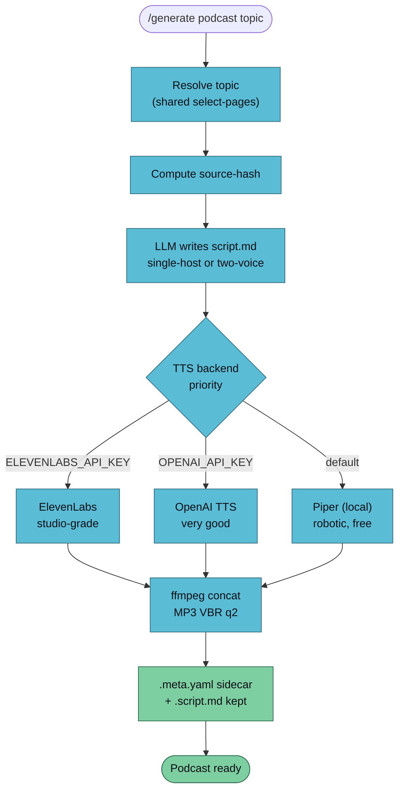

`/generate podcast` turns wiki pages into a 3–10 minute MP3 explainer. The LLM writes a spoken-word script, TTS renders each line, ffmpeg concatenates them. Single-host monologue by default; `--two-voice` for NotebookLM-style dialogue.



## Usage

```
/generate podcast <topic> [--vault <name>] [--length short|medium|long] [--two-voice] [--voice <name>]
```

| Flag | Default | Notes |
|------|---------|-------|
| `--length` | `medium` | `short` ≈ 3 min, `medium` ≈ 6 min, `long` ≈ 10 min |
| `--two-voice` | off | Dialogue between Host A and Host B |
| `--voice` | backend default | Override the TTS voice (Piper model id / OpenAI voice / ElevenLabs voice id) |

## Example

```bash
/generate podcast transformers --vault llm-wiki-research --two-voice
```

```
✅ Podcast generated
   Topic:       transformers
   Format:      two-voice
   TTS:         openai
   Length:      medium  (~6 min)
   Pages in:    8
   Source hash: 2dd9ed4a003f
   Script:      vaults/llm-wiki-research/artifacts/podcast/transformers-2026-04-18.script.md
   MP3:         vaults/llm-wiki-research/artifacts/podcast/transformers-2026-04-18.mp3
   Sidecar:     vaults/llm-wiki-research/artifacts/podcast/transformers-2026-04-18.meta.yaml
```

The `.script.md` is the primary re-renderable artifact — the MP3 is derived. Edit the script and re-run to change the narration without touching the wiki.

## TTS Backend Selection

The handler picks the best available backend, in priority order:

| Priority | Backend | Trigger | Cost per 1k chars | Quality |
|---------:|---------|---------|-------------------|---------|
| 1 | ElevenLabs | `ELEVENLABS_API_KEY` set | ~$0.30 | Studio-grade |
| 2 | OpenAI TTS | `OPENAI_API_KEY` set | ~$0.015 | Very good |
| 3 | Piper | fallback (lazy-installed) | free | Robotic but clean |

**Voice defaults:**

- **Piper**: `en_US-lessac-medium` (HOST / A), `en_GB-alan-medium` (B)
- **OpenAI**: `alloy` (HOST / A), `onyx` (B)
- **ElevenLabs**: `Rachel` (HOST / A), `Adam` (B) — override with `ELEVENLABS_VOICE_A` / `ELEVENLABS_VOICE_B`

## The `.script.md` Artifact

A generated script looks like this:

```md
# Podcast: transformers

_Generated 2026-04-18 · source hash 2dd9ed4a003f · length target medium (~6 min) · format two-voice_

[A]: Alright. Today we're getting into transformers.
[B]: Why this, why now?
[A]: Because the architecture quietly took over every language task. Here's the shape of it, from *wiki/concepts/attention.md*…
[B]: Huh. And how is that different from recurrent networks?
…
```

Script rules the LLM follows:

- Spoken-word, not bulleted summaries. Full sentences, natural cadence.
- `{{cite: path}}` placeholders rendered as *italic page names* before TTS.
- ~150 wpm target — short ≈ 450 words, medium ≈ 900, long ≈ 1500.
- Sources list at the end, spoken.

## Dependencies

Lazy-installed on first run:

| Tool | Install | Purpose | Required? |
|------|---------|---------|-----------|
| `ffmpeg` | `brew install ffmpeg` / `apt install ffmpeg` | MP3 concat | Yes |
| `piper` | `brew install piper-tts` | Local TTS | Only when no cloud key present |

## Troubleshooting

| Symptom | Cause | Fix |
|---------|-------|-----|
| "Piper not found and no cloud TTS key present" | Offline, Homebrew failing | Install Piper manually from [rhasspy/piper](https://github.com/rhasspy/piper) or set `OPENAI_API_KEY` |
| Clipped syllables between lines | ffmpeg concat list has missing newlines | Regenerate — the handler rebuilds the concat list each run |
| Robotic-sounding output | Piper is in use | Set `OPENAI_API_KEY` or `ELEVENLABS_API_KEY` for a quality upgrade |
| ElevenLabs cost higher than expected | Long script + premium voice | Use `--length short` or swap to `OPENAI_API_KEY` (20× cheaper per char) |

## Known Limitations (Phase 2C)

- **No music / intro stingers.** Pure voice. Deferred.
- **No ID3 chapters.** Would be nice for navigation — deferred.
- **Cost warnings** are documented but not enforced — you can burn ElevenLabs credit on a `long` podcast without a confirmation prompt. Phase 2E adds a pre-render cost check.
- **Piper voice library** is small by default. Custom voices go in `$PIPER_VOICES_DIR`.

## See Also

- [/generate overview](./generate) — the router
- [generate-video](./generate-video) — chains this handler for voiceover
- [Artifact conventions](../../reference/artifacts) — sidecar schema
