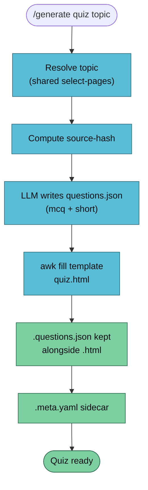

`/generate quiz` produces a self-contained HTML quiz — multiple choice + short answer, each question linking back to its source wiki page. Open the file in a browser, self-test, get a score. Email-able, offline, zero install.



## Usage

```
/generate quiz <topic> [--vault <name>] [--count <n>] [--difficulty easy|medium|hard]
```

| Flag | Default | Notes |
|------|---------|-------|
| `--count` | `10` | Number of questions |
| `--difficulty` | `medium` | Nudges question style (see table below) |

### Difficulty calibration

| Level | What the LLM aims for |
|-------|-----------------------|
| `easy` | Direct recall of a fact stated on the page |
| `medium` | Apply the concept to a slightly new scenario |
| `hard` | Compare two pages, or derive an implication |

## Example

```bash
/generate quiz attention --vault llm-wiki-research --count 8 --difficulty medium
```

```
✅ Quiz generated
   Topic:       attention
   Difficulty:  medium
   Questions:   8
   Source hash: 2dd9ed4a003f
   HTML:        vaults/llm-wiki-research/artifacts/quiz/attention-2026-04-18.html
   Questions:   vaults/llm-wiki-research/artifacts/quiz/attention-2026-04-18.questions.json
   Sidecar:     vaults/llm-wiki-research/artifacts/quiz/attention-2026-04-18.meta.yaml
   Open with:   open vaults/llm-wiki-research/artifacts/quiz/attention-2026-04-18.html
```

Double-click the `.html` or `open` it — no build step, no server.

## The `.questions.json` Artifact

The re-renderable source alongside the HTML:

```json
{
  "title": "Attention — Self-Test",
  "topic": "attention",
  "difficulty": "medium",
  "generated_at": "2026-04-18",
  "questions": [
    {
      "id": "q1",
      "type": "mcq",
      "prompt": "Which term describes the weighted context mechanism in transformers?",
      "options": ["Recurrence", "Attention", "Convolution", "Gating"],
      "correct": 1,
      "explanation": "Attention lets each token query every other token directly.",
      "source": "wiki/concepts/attention.md"
    },
    {
      "id": "q2",
      "type": "short",
      "prompt": "In one sentence, why does self-attention scale poorly with sequence length?",
      "correct_keywords": ["quadratic", "n^2", "token pairs"],
      "explanation": "Attention computes pairwise scores — O(n²) in sequence length.",
      "source": "wiki/concepts/self-attention.md"
    }
  ]
}
```

Edit the JSON and re-run without the wiki roundtrip. Also what Phase 2E's `verify-artifact` re-ingests for fidelity testing.

## Question-writing rules

The LLM follows a fixed contract when authoring the JSON:

- **Every question carries a `source` wiki page** — surfaced in the UI and used by Phase 2E.
- **MCQ options are 4 items**, exactly one correct, no "all of the above".
- **Short-answer `correct_keywords`** are match hints for lenient client-side grading, not an answer key.
- Explanations cite the source when possible.

## Template Authoring

The HTML template lives at `.claude/skills/generate-quiz/templates/quiz.html` — 270 lines, Observatory palette, vanilla JS, no framework. Two anchors get filled:

- `{{title}}` in the `<title>` and `<h1>`
- `<!-- QUIZ_DATA_HERE -->` inside `<script id="quiz-data" type="application/json">`

To customise, either edit the shipped template or drop a per-vault override at `<vault>/.templates/quiz/quiz.html`.

## Troubleshooting

| Symptom | Cause | Fix |
|---------|-------|-----|
| Short answers all marked wrong | Keywords too narrow in the JSON | Edit `correct_keywords` to include synonyms; re-run |
| Answers reset on reload | Intentional — no LocalStorage persistence | Add a 1-liner to the template if you want it |
| "Source" links 404 | Quiz file is not beside the `wiki/` directory | Keep the quiz in `artifacts/quiz/` next to `wiki/` |

## Known Limitations (Phase 2D)

- **Client-side grading is lenient.** Keyword-match short answers are good enough for self-study, not assessment.
- **Explanations always visible after attempting.** By design — failure plus immediate explanation is the best study loop.
- **No progress persistence.** Refresh resets answers.
- **Question quality varies with wiki coverage.** Sparse pages → repetitive questions.

## See Also

- [/generate overview](./generate) — the router
- [generate-flashcards](./generate-flashcards) — spaced-repetition sibling
- [Artifact conventions](../../reference/artifacts) — sidecar schema
