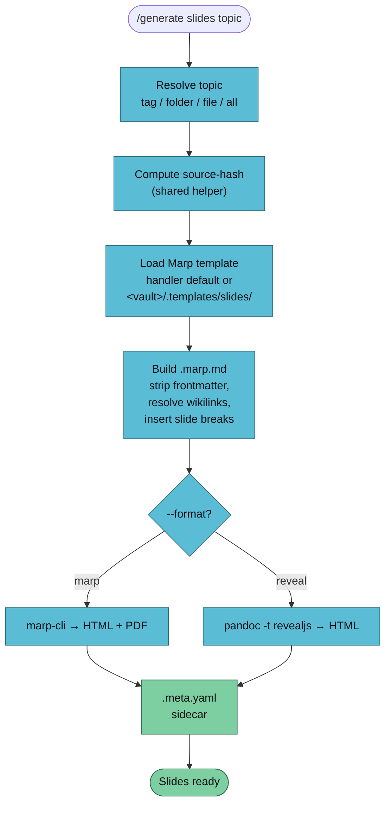

`/generate slides` turns wiki pages into a shareable presentation deck. Marp is the default renderer; pass `--format reveal` for Reveal.js HTML.



## Usage

```
/generate slides <topic> [--vault <name>] [--format marp|reveal] [--template <name>]
```

Same `<topic>` forms as the other handlers — tag, folder path, single file, or `all`.

## Example

```bash
/generate slides transformers --vault llm-wiki-research
```

Output:

```
✅ Slides generated
   Topic:       transformers
   Format:      marp
   Pages in:    8 (sorted)
   Source hash: 2dd9ed4a003f
   Markdown:    vaults/llm-wiki-research/artifacts/slides/transformers-2026-04-18.marp.md
   HTML:        vaults/llm-wiki-research/artifacts/slides/transformers-2026-04-18.html
   PDF:         vaults/llm-wiki-research/artifacts/slides/transformers-2026-04-18.pdf
   Sidecar:     vaults/llm-wiki-research/artifacts/slides/transformers-2026-04-18.meta.yaml
```

The `.marp.md` is kept alongside the rendered outputs — it's both an artifact and a re-renderable source.

## Dependencies

Lazy-installed on first run:

| Tool | Install | Purpose |
|------|---------|---------|
| `marp-cli` | `pnpm add -g @marp-team/marp-cli` (or `npm i -g`) | Marp → HTML + PDF |
| `pandoc` | inherited from Phase 2A | Reveal.js rendering |

If `marp-cli` can't be installed, the handler falls back to `npx @marp-team/marp-cli` for the single invocation.

## Formats

### Marp (default)

Emits a Marp-annotated markdown file + HTML preview + printable PDF. Fast, paginated, works offline.

### Reveal.js (`--format reveal`)

Emits Reveal.js HTML only — PDF is intentionally omitted because browser-print-to-PDF is brittle. Good when you want HTML-native features (fragments, speaker notes, animations).

## Customisation

### Vault-local template override

Drop a replacement template at `<vault>/.templates/slides/default.md` to ship house style per-vault. The handler prefers vault-local templates over the shipped default.

Placeholders the template can use:

- `{{title}}` — topic as title case
- `{{author}}` — vault owner (from vault CLAUDE.md or git config)
- `{{date}}` — generation date
- `{{source_count}}` — number of pages included
- `{{body}}` — rendered page bodies, separated by slide breaks

### Explicit template

```bash
/generate slides transformers --template compact
```

Resolution order: `--template` flag → vault-local `.templates/slides/<name>.md` → shipped `templates/<name>.md` → shipped `default.md`.

## Slide Sizing Rules

Marp does **not** auto-paginate — a slide with too much content overflows silently. The handler applies a soft rule:

- ≤ 12 lines of markdown per slide.
- Slides over the limit are split on the nearest heading or bullet, continuation slides titled `<Title> (cont.)`.

Pure `<text>` SVG elements don't wrap either — if you embed SVG in a slide, use `<foreignObject>` with HTML inside.

## Known Limitations (Phase 2B)

- **Mermaid blocks** are not rendered to PNG yet — same limitation as book/pdf in Phase 2A. Phase 2E ships a `mermaid-cli → PNG` pre-pass.
- **Reveal.js PDF** is deliberately omitted; use browser print or Decktape manually.
- **Wikilinks** render as italic inline text (shared limitation with the other handlers).
- **`---` slide separator** collides with YAML frontmatter — safe because frontmatter only has one leading pair, but keep an eye out when authoring templates.

## See Also

- [/generate overview](./generate) — the router
- [generate-book](./generate-book) — for prose output
- [generate-mindmap](./generate-mindmap) — tree-shaped sibling
- [Artifact conventions](../../reference/artifacts) — sidecar schema
