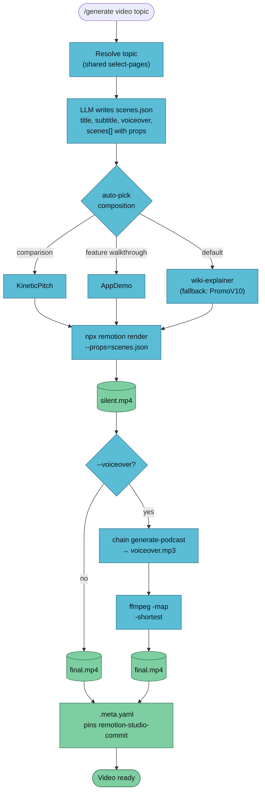

`/generate video` produces an animated explainer MP4 from wiki pages. It wraps an external Remotion repo as the renderer, picks a composition based on topic shape, and muxes in an optional voiceover from `generate-podcast`.



## Usage

```
/generate video <topic> [--vault <name>] [--composition <id>] [--voiceover] [--length short|medium|long]
```

| Flag | Default | Notes |
|------|---------|-------|
| `--composition` | auto-pick | Pick a Remotion composition by id |
| `--voiceover` | off | Chain `generate-podcast` for narration, then mux |
| `--length` | `medium` | Forwarded to the voiceover podcast pipeline |

## Example

```bash
/generate video "rag vs fine-tuning" --vault llm-wiki-research --voiceover
```

```
✅ Video generated
   Topic:       rag vs fine-tuning
   Composition: KineticPitch
   Remotion at: a8b2c1f
   Voiceover:   yes
   Pages in:    4
   Source hash: c9f1a8d4b622
   Scenes:      vaults/llm-wiki-research/artifacts/video/rag-vs-fine-tuning-2026-04-18.scenes.json
   MP4:         vaults/llm-wiki-research/artifacts/video/rag-vs-fine-tuning-2026-04-18.mp4
   Sidecar:     vaults/llm-wiki-research/artifacts/video/rag-vs-fine-tuning-2026-04-18.meta.yaml
```

## The remotion-studio Dependency

This handler does **not** include the renderer — Remotion compositions live in [`remotion-studio`](https://github.com/RonanCodes/remotion-studio), a peer repo. The handler reads compositions from there and invokes `npx remotion render`.

Set up:

```bash
git clone https://github.com/RonanCodes/remotion-studio.git ~/Dev/ai-projects/remotion-studio
cd ~/Dev/ai-projects/remotion-studio && pnpm install   # or npm install
```

Override the path via environment:

```bash
REMOTION_STUDIO_DIR=/custom/path /generate video <topic>
```

The sidecar pins the exact `remotion-studio-commit` used — essential for re-renderability, because composition props drift between commits.

## Composition Picker

Shipped compositions (see `remotion-studio/src/Root.tsx`):

| id | Duration | Use when |
|----|---------:|----------|
| `KineticPitch` | 32s | Topic with a strong hook |
| `PromoV10` | 56s | Multi-concept walkthrough |
| `PromoV2`–`PromoV9` | varies | Style experiments (light/dark/synth/screenshots) |
| `AppDemo` | varies | Feature demos |
| `MarketingPromo` | varies | Vault overview |
| `wiki-explainer` | *(deferred)* | Default once shipped — topic overviews tuned for `/generate video` |

Auto-pick rule:

- Topic contains `vs` / `versus` OR scenes include `side_by_side` → **`KineticPitch`**
- Topic looks like a feature walkthrough → **`AppDemo`**
- Otherwise → **`wiki-explainer`** (fallback to `PromoV10` until `wiki-explainer` lands)

Override with `--composition <id>`.

## The `scenes.json` Contract

```json
{
  "title": "RAG vs Fine-Tuning",
  "subtitle": "When each pattern wins",
  "voiceover_script": "...full narration...",
  "scenes": [
    { "id": "intro",        "duration_s": 4,  "props": { "headline": "RAG vs Fine-Tuning" } },
    { "id": "problem",      "duration_s": 6,  "props": { "question": "Which should you pick when?" } },
    { "id": "side_by_side", "duration_s": 10, "props": {
        "left_name":  "RAG",       "left_bullets":  ["cheap updates", "no retraining"],
        "right_name": "Fine-tune", "right_bullets": ["lower latency", "stylistic fidelity"]
    } },
    { "id": "verdict", "duration_s": 5, "props": { "verdict": "RAG for recall; fine-tune for voice" } }
  ]
}
```

Remotion reads this via `--props=<file>`. Composition components destructure props as usual.

Like `.script.md` for podcasts and `.outline.md` for mindmaps, `scenes.json` is the re-renderable source artifact — edit and re-run rather than regenerating from the wiki.

## Voiceover Muxing

When `--voiceover` is set, the handler chains `generate-podcast` using `scenes.voiceover_script` as the pre-written script, then muxes:

```bash
ffmpeg -i silent.mp4 -i voiceover.mp3 \
  -map 0:v:0 -map 1:a:0 \
  -c:v copy -c:a aac -b:a 192k -shortest \
  final.mp4
```

`-shortest` trims whichever stream finishes first. Match voiceover length to composition duration at script-writing time — otherwise the video silently tails off or the narration gets clipped.

## Dependencies

| Tool | Install | Purpose | Required? |
|------|---------|---------|-----------|
| `node` 20+ | nvm / brew / apt | Remotion runtime | Yes |
| `ffmpeg` | `brew install ffmpeg` | Muxing voiceover | Only with `--voiceover` |
| `remotion-studio` | clone the peer repo | The renderer itself | Yes |

## Authoring New Compositions

Compositions live in `remotion-studio/src/projects/llm-wiki/`. To add one:

1. Create `YourComposition.tsx`. Destructure props from the component signature.
2. Register in `src/Root.tsx`:
   ```tsx
   <Composition
     id="YourComposition"
     component={YourComposition}
     durationInFrames={N * 30}  // N seconds at 30fps
     fps={30}
     width={1920}
     height={1080}
     defaultProps={{ /* demo defaults */ }}
   />
   ```
3. Update the "Composition id" table in `.claude/skills/generate-video/SKILL.md` and in this doc.
4. Use the Observatory palette for brand consistency: amber `#e0af40`, cyan `#5bbcd6`, green `#7dcea0` on dark `#0b0f14`.
5. Hot-reload via `npx remotion preview` from `remotion-studio/`.

## Troubleshooting

| Symptom | Cause | Fix |
|---------|-------|-----|
| "remotion-studio not found" | Peer repo not cloned | Clone per the setup block above, or set `REMOTION_STUDIO_DIR` |
| `npx remotion render` exits on "bundle failed" | node_modules stale or version mismatch | `rm -rf remotion-studio/node_modules && pnpm install` |
| Rendered video tails off into silence | Voiceover shorter than composition | Increase podcast length or pick a shorter composition |
| Voiceover cut off mid-sentence | Voiceover longer than composition | Decrease `--length` or pick a longer composition |
| Chromium download prompt during render | First render on a machine | Let Remotion cache Chromium once (~200MB); subsequent renders reuse |

## Known Limitations (Phase 2C)

- **No `wiki-explainer` composition shipped yet.** Default auto-pick falls through to `PromoV10`.
- **Render time** ≈ 2–4 min for 56s at 1080p on an M-series Mac. Expect to wait.
- **Voiceover sync** is open-loop — no automatic duration check. Phase 2E adds a pre-render duration guard.
- **Composition drift** between remotion-studio commits is defended only by the `remotion-studio-commit` sidecar pin — not enforced at render time.

## See Also

- [/generate overview](./generate) — the router
- [generate-podcast](./generate-podcast) — voiceover source
- [Artifact conventions](../../reference/artifacts) — sidecar schema
- [remotion-studio repo](https://github.com/RonanCodes/remotion-studio) — external Remotion compositions
