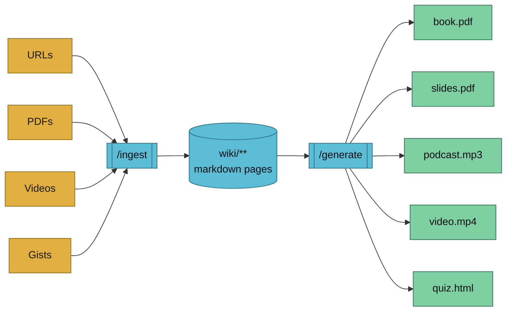

`/generate` is the **mirror of `/ingest`**. Where `/ingest` funnels many formats into one canonical wiki, `/generate` fans that canonical wiki back out into any number of consumable formats.



## Usage

```
/generate <type> <topic> [--vault <name>] [handler-specific flags]
```

Examples:

```
/generate book transformers --vault llm-wiki-research
/generate pdf wiki/concepts/attention.md --vault llm-wiki-research
/generate slides rag-patterns --vault llm-wiki-research --count 15
/generate podcast "llm wiki design" --length medium
/generate video transformers
/generate quiz attention --difficulty medium --count 10
```

## How It Works

`/generate` is a **thin router**. It:

1. Reads the first positional argument as the artifact **type** (`book`, `pdf`, `slides`, …).
2. Looks up the matching handler skill at `.claude/skills/generate-<type>/SKILL.md`.
3. Resolves `--vault` (single vault auto-picks; multi-vault prompts).
4. Forwards every remaining argument to the handler.
5. The handler does the rest — selection, rendering, sidecar, commit.

No registry. Adding a new artifact type is just creating a new `.claude/skills/generate-<your-type>/` directory. The router picks it up on the next invocation.

## Currently-Implemented Handlers

Phases 2A–2D have shipped the full artifact surface:

| Type | Handler | Phase | Purpose |
|------|---------|-------|---------|
| `book` | `generate-book` | 2A ✅ | Pandoc-rendered book PDF with title page + TOC |
| `pdf` | `generate-pdf` | 2A ✅ | Shareable PDF from a page or folder (no ceremony) |
| `slides` | `generate-slides` | 2B ✅ | Marp (default) or Reveal.js deck |
| `mindmap` | `generate-mindmap` | 2B ✅ | Markmap HTML (Mermaid fallback) |
| `infographic` | `generate-infographic` | 2B ✅ | Observatory-themed SVG + optional PNG |
| `podcast` | `generate-podcast` | 2C ✅ | TTS-rendered MP3 (ElevenLabs / OpenAI / Piper) |
| `video` | `generate-video` | 2C ✅ | Remotion MP4 with optional voiceover mux |
| `quiz` | `generate-quiz` | 2D ✅ | Single-file HTML self-test |
| `flashcards` | `generate-flashcards` | 2D ✅ | Anki `.apkg` deck (stable deck IDs) |
| `app` | `generate-app` | 2D ✅ | Vite + React explorer app (2 templates) |

Invoking a not-yet-implemented type prints a clear error listing the handlers currently available.

## Artifact Contract

Every handler must follow the [artifact conventions](../../reference/artifacts):

- Output path `vaults/<vault>/artifacts/<type>/<topic>-<date>.<ext>`
- `.meta.yaml` sidecar with provenance fields
- Deterministic `source-hash` via the shared `source-hash.sh` helper

This contract is what makes [drift detection](../lint) and [round-trip fidelity testing](../../research/roadmap) possible in later phases.

## See Also

- [generate-book](./generate-book) — the full-book handler
- [generate-pdf](./generate-pdf) — the single-page/folder handler
- [generate-slides](./generate-slides) — presentation deck handler
- [generate-mindmap](./generate-mindmap) — interactive mindmap handler
- [generate-infographic](./generate-infographic) — SVG infographic handler
- [generate-podcast](./generate-podcast) — spoken-word MP3 handler
- [generate-video](./generate-video) — Remotion MP4 handler
- [generate-quiz](./generate-quiz) — single-file HTML self-test
- [generate-flashcards](./generate-flashcards) — Anki `.apkg` deck
- [generate-app](./generate-app) — Vite + React explorer app
- [artifact conventions](../../reference/artifacts) — storage path, sidecar schema, source-hash algorithm
- [/ingest](./ingest) — the opposite direction
