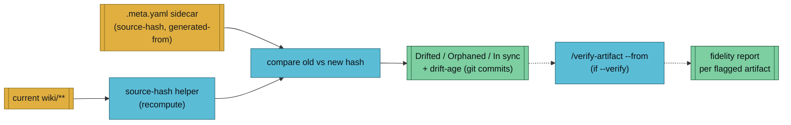

The `/lint` skill has two modes. The default mode runs 8 health checks against your wiki and outputs a severity-grouped report. The `--artifacts` mode walks generated artifacts and flags any whose source pages have drifted since generation.

## Usage

```
# Wiki health check
/lint --vault my-research
/lint --vault my-research --fix

# Artifact drift detection
/lint --vault my-research --artifacts
/lint --vault my-research --artifacts --verify
```

| Flag | Description |
|------|-------------|
| `--vault <name>` | Target vault |
| `--fix` | Auto-fix what's fixable (missing frontmatter, stubs, domain tags, index) |
| `--artifacts` | Run artifact drift-detection mode instead of wiki checks |
| `--verify` | (With `--artifacts`) chain into `/verify-artifact` for each flagged artifact |

## The 8 Checks

| # | Check | Severity | Auto-fixable |
|---|-------|----------|-------------|
| 1 | **Frontmatter completeness** -- title, dates, page-type, domain, sources, related | Critical | Yes |
| 2 | **Orphan pages** -- no inbound links from any other page | Warning | No |
| 3 | **Broken wikilinks** -- `[[target]]` references where target doesn't exist | Critical | Yes (creates stubs) |
| 4 | **Missing source links** -- pages without `sources` frontmatter or `## Sources` section | Critical | Yes |
| 5 | **Missing domain tags** -- pages without the vault's default domain | Warning | Yes |
| 6 | **Concepts without pages** -- frequently mentioned terms that lack a concept page | Info | Yes (creates stubs) |
| 7 | **Stale content** -- `date-modified` significantly older than related pages | Warning | No |
| 8 | **Index completeness** -- pages missing from index, or index entries for deleted pages | Warning | Yes |

## Report Format

The report is grouped by severity:

```markdown
## Wiki Lint Report -- my-research

### Summary
- Total pages: 42
- Issues found: 7 (4 auto-fixable)

### Critical (broken links, missing sources)
- [[missing-page]] referenced by [[page-1]], [[page-2]] but doesn't exist
- wiki/sources/article.md has empty sources frontmatter

### Warning (orphans, missing metadata)
- wiki/entities/old-tool.md is orphaned (no inbound links)
- wiki/concepts/some-idea.md missing domain tag

### Info (suggestions)
- "machine learning" mentioned 8 times but has no concept page
- Consider ingesting more sources on <topic>
```

## What `--fix` Does

When `--fix` is set, lint auto-repairs:
- Adds missing frontmatter fields with vault defaults
- Creates stub pages for broken wikilinks
- Adds vault default domain to pages missing it
- Creates stub concept pages for frequently mentioned terms
- Syncs `wiki/index.md` with actual pages on disk
- Auto-commits all fixes with a summary

## After Linting

Lint suggests next actions based on gaps found:
- New questions to investigate
- Sources to ingest for thin coverage areas
- Cross-references that should exist between pages

## Artifact Drift Detection

With `--artifacts`, lint skips the wiki checks and walks `vaults/<name>/artifacts/**/*.meta.yaml` to recompute each artifact's `source-hash` against the current wiki pages. Mismatches = drift.



### Report Buckets

| Bucket | Meaning |
|--------|---------|
| **Drifted** | Hash changed since generation. Old hash, new hash, drift age (commits on source pages since `generated-at`) are reported |
| **Orphaned** | At least one source page no longer exists (deleted or moved) |
| **In sync** | Hash still matches — artifact is up to date |

### Why Two Tools, Not One

`/lint --artifacts` is the cheap filter; [`/verify-artifact`](./verify-artifact.md) is the expensive check. Use them together.

| Aspect | `/lint --artifacts` | `/verify-artifact` |
|--------|--------------------|--------------------|
| Cost | O(ms) per artifact (one hash recompute) | O(s–min) per artifact (regenerate + re-ingest + score) |
| Scope | All artifacts in a vault | One artifact |
| Answers | "Has anything drifted?" | "How faithful is this artifact?" |
| CI fit | Fast pre-check on every push | Nightly, or on flagged only |

`--verify` chains them: lint runs first to surface drift, then automatically calls `/verify-artifact --from <path>` on each drifted artifact and appends a Verification Results section. Use this when you want the full picture in one run.

### Exit Codes

| Code | Meaning |
|------|---------|
| `0` | No drift, or drift reported without `--verify` |
| `1` | Drift + `--verify` and at least one verification fell below its target |
| `2+` | Infrastructure error (unreadable sidecar, missing source-hash helper, etc.) |

This makes `/lint --artifacts --verify` CI-usable against the [golden corpus](../reference/golden-corpus.md).

## See Also

- [verify-artifact](./verify-artifact.md) — round-trip fidelity test
- [artifact conventions](../reference/artifacts.md) — `.meta.yaml` sidecar + source-hash contract
- [fidelity scoring](../reference/fidelity-scoring.md) — tiers, weighting, per-type targets
- [golden corpus](../reference/golden-corpus.md) — frozen CI fixture
