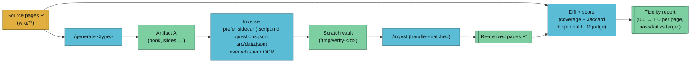

The `/verify-artifact` skill is the inverse of `/generate`. It takes an artifact type + topic, regenerates the artifact, re-ingests it into a throwaway scratch vault, diffs the reconstructed pages against the originals, and emits a fidelity score. An artifact is *faithful* if most of what was in the source wiki survives the round trip.

This is the user-facing half of the close-the-loop testing system — the cheap drift-detection counterpart is [`/lint --artifacts`](./lint.md#artifact-drift-detection).

## Usage

```
/verify-artifact book --vault my-research --topic attention
/verify-artifact quiz --vault my-research --topic rag --target 0.50
/verify-artifact slides --vault my-research --topic transformers --llm-judge
/verify-artifact --from vaults/my-research/artifacts/book/attention-2026-04-17.pdf
```

| Flag | Description |
|------|-------------|
| `<type>` | Artifact type — one of the `/generate` handler types |
| `--vault <name>` | Target vault |
| `--topic <slug>` | Topic argument (same as `/generate`) |
| `--target <float>` | Override the default per-type fidelity target |
| `--llm-judge` | Add the expensive LLM-judge scoring tier (fact-level diff) |
| `--keep-scratch` | Preserve `/tmp/verify-<id>/` for manual inspection |
| `--from <path>` | Verify an existing artifact without regenerating. Pairs with `/lint --artifacts` |

## The Round Trip



## Inverse-Path Preference

Every `generate-*` handler ships a **re-renderable source sidecar** alongside its binary output. That sidecar is what `/verify-artifact` re-ingests — not the binary. Reading back from the sidecar is cheap, deterministic, and avoids pulling in heavyweight dependencies like whisper or OCR.

| Artifact type | Preferred inverse | Heavy fallback |
|---------------|-------------------|----------------|
| book, pdf | the PDF itself → pdftotext | — |
| slides | `.script.md` outline | HTML → pandoc |
| podcast | `.script.md` | MP3 → whisper |
| video | `.scenes.json` | MP4 → whisper + OCR on keyframes |
| quiz | `.questions.json` | HTML parse |
| flashcards | `.cards.csv` | .apkg unpack |
| app | `src/data.json` | — |
| mindmap | heading tree JSON | HTML parse |
| infographic | slot-fill YAML | SVG text extraction |

When a handler doesn't have a re-renderable sidecar yet, the heavy fallback kicks in. Today the common case (book, slides, podcast, quiz, flashcards, app) uses the cheap path.

## Scoring

Fidelity is a weighted combination of two structural scores and an optional semantic score:

| Tier | Score | What it measures | Cost |
|------|-------|------------------|------|
| 1 | **Coverage** | Per-page: ≥50% concept overlap → page "survived." Corpus-level: fraction of original pages that survived | O(ms) |
| 2 | **Jaccard** | Concept-set similarity across the whole corpus: `|P ∩ P'| / |P ∪ P'|` | O(ms) |
| 3 | **LLM judge** | Claude reads both versions, reports fact-level agreements and drift. Flag-gated | O(s), paid |

Default weighting: **fidelity = 0.6 × coverage + 0.4 × jaccard**. The 60/40 split rewards "every page survived" over "vocabulary overlapped" — a lossy artifact that perfectly preserves 3/10 pages scores lower than one that loosely preserves 10/10 pages.

Concept extraction is heuristic: `[[wikilinks]]`, frontmatter `tags:`, and capitalised multi-word terms. It's good enough for structural comparison but not word-for-word. For word-level fidelity, use `--llm-judge`.

## Per-Type Targets

Defaults ship inside the skill. Override with `--target <float>` when a vault is exceptional (e.g. heavy code-block content makes flashcards harder to reconstruct).

See [fidelity scoring reference](../reference/fidelity-scoring.md) for the full target table and the reasoning behind each number.

## Exit Codes

Usable directly in CI:

| Code | Meaning |
|------|---------|
| `0` | Fidelity ≥ target (pass) |
| `1` | Fidelity < target (fail) |
| `2+` | Infrastructure error (missing artifact, ingest crash, etc.) |

The [golden-corpus workflow](../reference/golden-corpus.md) uses this with `continue-on-error: true` during advisory rollout; per-project CI can remove the flag once scores stabilise.

## When to Use

- **On demand** — "did this book actually capture what's in my wiki?"
- **After a handler change** — run against the [golden corpus](../reference/golden-corpus.md) to catch template regressions.
- **Chained from lint** — `/lint --artifacts --verify` calls this on drifted artifacts only, cheap filter then expensive check.
- **Before shipping an artifact externally** — confirm fidelity before sharing with stakeholders.

## Known Limitations

- **Concept extraction is lossy.** Some pages with heavy prose and few proper nouns under-extract. The LLM-judge tier works around this for pages where it matters.
- **Binary-only paths (MP4 whisper + OCR) are deferred.** The `.scenes.json` sidecar covers video for now; re-ingesting the rendered MP4 itself waits for a future iteration.
- **Scoring is structural by default.** Two pages that convey the same idea in totally different words will still diff badly in coverage/jaccard. `--llm-judge` is how you catch that — by design, at a cost.

## See Also

- [close-the-loop testing](../research/close-the-loop-testing.md) — the design doc
- [fidelity scoring reference](../reference/fidelity-scoring.md) — tiers, weighting, targets
- [lint --artifacts](./lint.md#artifact-drift-detection) — the cheap drift-detection counterpart
- [golden corpus](../reference/golden-corpus.md) — the CI regression fixture
- [artifact conventions](../reference/artifacts.md) — sidecar + source-hash contract
