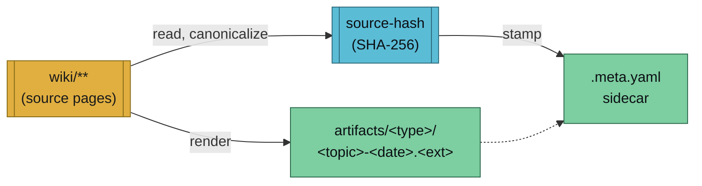
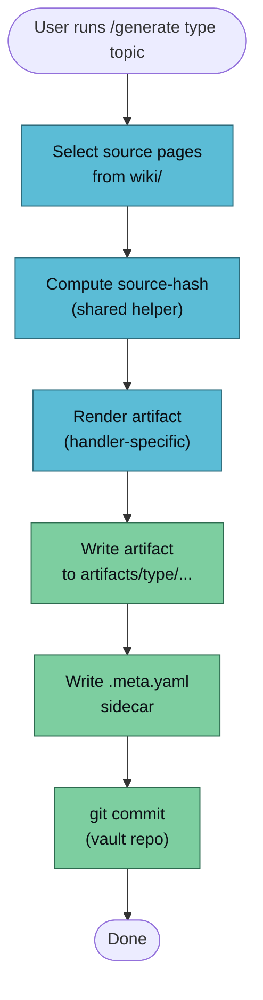

Every artifact produced by `/generate` follows the same convention: predictable path, provenance sidecar, deterministic source-hash. This page is the contract each `generate-<type>` handler must honour so that drift detection (`/lint --artifacts`) and round-trip fidelity (`/verify-artifact`) work across the whole system.

## Mental Model



## Storage Path

```
vaults/<vault>/artifacts/<type>/<topic>-<date>.<ext>
vaults/<vault>/artifacts/<type>/<topic>-<date>.meta.yaml   ← sidecar
```

| Segment | Value | Example |
|---------|-------|---------|
| `<vault>` | Vault name (without the `llm-wiki-` prefix is fine; full name is fine too — handlers receive whatever the user passed) | `llm-wiki-research` |
| `<type>` | Artifact type — matches the handler slug | `book`, `pdf`, `slides`, `podcast`, `video`, `quiz`, `flashcards`, `app`, `mindmap`, `infographic` |
| `<topic>` | Kebab-cased topic slug derived from the topic argument | `attention`, `rag-patterns`, `llm-wiki-design` |
| `<date>` | ISO date, `YYYY-MM-DD` | `2026-04-17` |
| `<ext>` | Handler-specific extension | `.pdf`, `.html`, `.mp3`, `.mp4`, `.apkg` |

The `artifacts/` directory is **gitignored** by default in every vault (scaffolded by `/vault-create`). Artifacts are derivable from `wiki/`; don't commit them. Regenerate on demand.

Handlers that produce a directory (e.g. `generate-app`) use the same pattern but the `<ext>` position becomes a directory with an internal structure, and the sidecar sits next to it:

```
vaults/<vault>/artifacts/app/rag-explorer-2026-04-17/
vaults/<vault>/artifacts/app/rag-explorer-2026-04-17.meta.yaml
```

## Provenance Sidecar (`.meta.yaml`)

Every artifact ships with a tiny YAML sidecar. Keep it small enough that any shell script can read or write it without a YAML library.

```yaml
# vaults/llm-wiki-research/artifacts/book/attention-2026-04-17.meta.yaml
generator: generate-book@0.1.0
generated-at: 2026-04-17T06:05:00+01:00
template: book-default
generated-from:
  - wiki/concepts/attention.md
  - wiki/concepts/self-attention.md
  - wiki/entities/transformer.md
source-hash: 2dd9ed4a003f9a778453f3b5a091b86a7580cf6a4befe648bf12f6535d958432
```

| Field | Meaning |
|-------|---------|
| `generator` | Handler slug + version. Bump the version when the rendering pipeline changes in a way that affects output. |
| `generated-at` | ISO 8601 timestamp (local TZ is fine). Used by `/lint --artifacts` to report drift age. |
| `template` | Name of the template used by the handler. Free-form string keyed by the handler (e.g. `book-default`, `slides-deck`, `quiz-mcq`). |
| `generated-from` | List of wiki page paths (repo-relative, POSIX slashes) that the artifact was rendered from. Order is the order they were concatenated. |
| `source-hash` | Deterministic SHA-256 over the canonicalised `generated-from` files. See algorithm below. |

Optional fields a handler may add (but none are required):

- `topic`: the raw topic argument as passed by the user
- `flags`: a map of handler-specific flags that affected output (e.g. `{count: 10, difficulty: "medium"}`) — used by the close-the-loop test to reproduce the artifact deterministically
- `duration-seconds`: runtime in seconds (for handler-level cost/latency tracking)

## Source-Hash Algorithm

The shared helper lives at `.claude/skills/generate/lib/source-hash.sh`. Every handler calls it rather than rolling its own, so drift-detection and round-trip tests agree on a single canonical form.

```bash
# Compute hash from a list of wiki page paths
HASH=$(./.claude/skills/generate/lib/source-hash.sh \
    wiki/concepts/attention.md \
    wiki/entities/transformer.md)
echo "$HASH"
# 2dd9ed4a003f9a778453f3b5a091b86a7580cf6a4befe648bf12f6535d958432
```

Canonicalization rules (applied to each file in lexicographically-sorted order, then concatenated with a `\n---\n` separator and a trailing `\n`):

1. Normalise line endings to LF (strip `\r`).
2. Strip trailing whitespace from every line.
3. Collapse runs of blank lines to a single blank line.
4. Trim leading/trailing blank lines on the whole file.

**Internal whitespace is treated as content**, not formatting. Changing `quadratic in` to `quadratic  in` (extra space mid-line) alters the hash — the same rule markdown parsers use when whitespace is semantic inside code blocks, tables, or definition lists.

### Invariants

The algorithm satisfies four properties, covered by the helper's test suite at `.claude/skills/generate/lib/tests/test-source-hash.sh`:

- **Whitespace invariance (formatting).** Extra blank lines, trailing spaces, Windows CRLF, or extra trailing newlines at end-of-file must **not** change the hash.
- **Content sensitivity.** Any substantive change (word added, sentence edited, internal whitespace altered) **must** change the hash.
- **Order independence.** Passing the same files in a different order must yield the same hash.
- **Error handling.** Missing or unreadable files produce a non-zero exit; empty input produces a non-zero exit. Handlers can rely on `set -e` semantics.

Run the tests any time the helper changes:

```bash
bash .claude/skills/generate/lib/tests/test-source-hash.sh
```

### Why SHA-256 + canonical text

Other options considered and rejected:

| Choice | Why not |
|--------|---------|
| Git `tree-ish` hash | Depends on blob mode and permissions; whitespace-sensitive; tied to commit |
| Content-addressable hash of raw bytes | A lone trailing newline change would force a re-verify |
| MD5 | Fine for non-security use but SHA-256 is universally available and the output length is still comfortable |
| Timestamp | Not deterministic — two invocations of the same generation should produce the same hash |

## How Handlers Use This

Handler lifecycle (every `generate-<type>` skill must implement):



## Drift Detection

`/lint --artifacts` (shipping in Phase 2E) walks `artifacts/**/*.meta.yaml`, recomputes `source-hash` from the current wiki pages listed in `generated-from`, and flags any mismatches with:

- artifact path
- old hash (from sidecar)
- new hash (recomputed)
- drift age (commit count on the source pages since `generated-at`)

The sidecar is the contract that makes drift detection possible. Missing sidecar = artifact is orphaned and cannot be verified.

## Round-Trip Fidelity

`/verify-artifact <type> <topic>` (Phase 2E) generates the artifact, re-ingests it into a scratch vault via the matching `/ingest` handler, and diffs the reconstructed pages against the originals. Target fidelity per artifact type is recorded in `vaults/llm-wiki/wiki/concepts/close-the-loop-testing.md`.

The `source-hash` on the sidecar is how the verifier decides whether a re-ingest result matches "the world the artifact was generated from" — reproducibility, not just freshness.

## See Also

- [Commands reference](./commands.md) — `/generate` usage
- [Source types](./source-types.md) — the opposite side: `/ingest` handlers
- [Page templates](./page-templates.md) — frontmatter conventions for the wiki pages artifacts are built from
