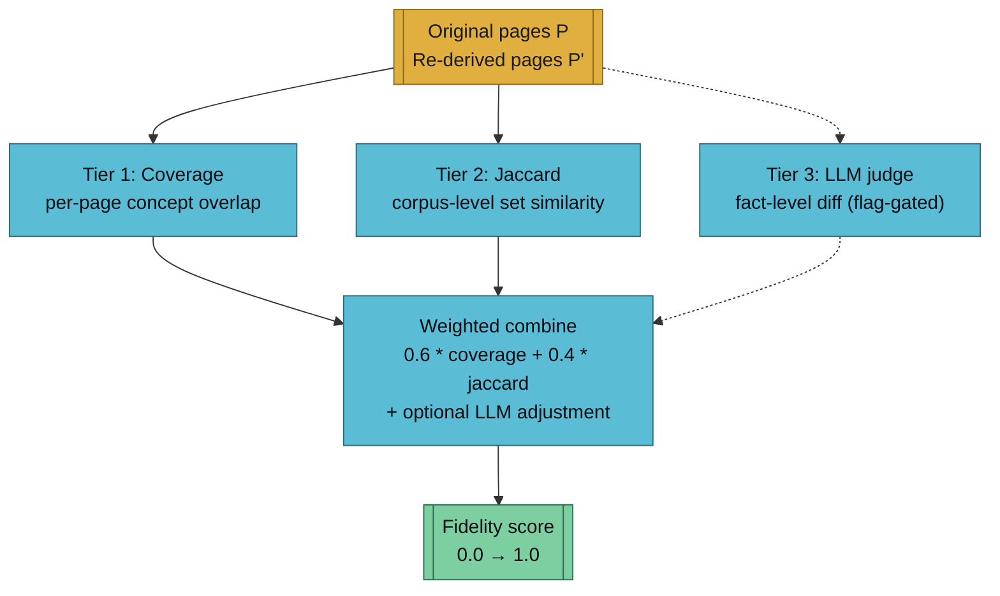

Fidelity scoring answers one question: **if I ran the artifact back through `/ingest`, how much of the original wiki would I recover?** The answer is a number between 0.0 and 1.0, compared against a per-artifact-type target.

## Three Tiers



### Tier 1 — Coverage

For each original page, extract its concept set (wikilink targets + frontmatter tags + capitalised multi-word terms). Find the closest re-derived page by title or slug. If the re-derived page retains ≥50% of the original's concepts, the page **survived**.

```
coverage = (pages that survived) / (original pages)
```

Per-page threshold is deliberately low (0.5, not 0.8) because lossy artifact types legitimately drop ~half the surface content — slides compress aggressively, flashcards split into atoms. A higher threshold would punish types that are supposed to compress.

### Tier 2 — Jaccard

Union-level set similarity over all extracted concepts across both corpora:

```
jaccard = |concepts(P) ∩ concepts(P')| / |concepts(P) ∪ concepts(P')|
```

Jaccard complements coverage: it catches cases where every page survived individually but the overall vocabulary shifted (synonyms drifted, or the artifact invented concepts not in the source). It also doesn't depend on page-level matching, so it's robust when the re-ingest produces a different page count.

### Tier 3 — LLM Judge (optional)

Flag-gated via `--llm-judge`. Claude reads both corpora and produces a fact-level comparison: "these 12 facts from the original survived, these 3 were dropped, these 2 were added." Slower and paid, but catches semantic equivalence (different wording, same fact) that structural scoring misses.

Not run by default because:

- Most regressions show in tiers 1 + 2.
- Per-run cost adds up in CI.
- The result is harder to unit-test — a model's verdict shifts over time.

Use it when tiers 1 + 2 flag a failure you want to investigate, or on the golden corpus during a template overhaul.

## Weighting

Default:

```
fidelity = 0.6 * coverage + 0.4 * jaccard
```

The 60/40 split favours **"every page survived"** over **"vocabulary overlapped."** A lossy artifact that preserves 3 of 10 pages perfectly should score lower than one that loosely preserves 10 of 10. Coverage is the stricter signal; Jaccard is the broader floor.

When `--llm-judge` is used, the judge produces a multiplier in [0.85, 1.15] applied to the structural score — never dominating, only nudging. This is deliberate: the LLM's verdict should refine, not replace, the deterministic math.

## Per-Artifact Targets

Targets come from [close-the-loop testing](../research/close-the-loop-testing.md) and are encoded in `.claude/skills/verify-artifact/SKILL.md`.

| Artifact type | Target | Reasoning |
|---------------|--------|-----------|
| `book` | **0.85** | Pandoc PDF — concatenation + formatting preserves nearly all prose |
| `pdf` | **0.85** | Same as book — a printable dump of the same source text |
| `podcast` | **0.75** | Spoken-word rephrasing drops headings/structure but keeps ideas |
| `video` | **0.60** | Scene-card compression; narration covers ~60% of content |
| `mindmap` | **0.50** | Headings + bullets → captures skeleton but loses prose |
| `flashcards` | **0.40** | Card-level chunking loses flow and cross-references |
| `quiz` | **0.40** | Questions test ideas without stating them directly |
| `slides` | **0.35** | Heavy rewording; bullet-level compression |
| `app` | **0.25** | JSON fixture keeps structure but strips prose entirely |
| `infographic` | **0.25** | SVG slots are single-phrase summaries |

**Exceeding the target is fine.** The targets represent the *minimum* faithful reconstruction — falling consistently below is a regression, overshooting isn't.

### Why the spread?

The 0.25 → 0.85 range reflects that different artifacts compress content at different rates — and that's the point. A book should be approximately the same information as the source; an infographic is a one-glance summary. Holding them to the same fidelity bar would make one or the other useless.

### Overriding

Per-vault or per-topic overrides live on the command line:

```
/verify-artifact quiz --vault my-research --topic rag --target 0.55
```

Use this when the content shape deviates — a heavily code-heavy topic will score worse on quiz and flashcards because code blocks resist concept extraction.

## What Counts as a Concept

Concepts are extracted from three sources, lowest false-positive first:

1. `[[wikilink]]` targets in the page body — always intentional.
2. `tags:` list in frontmatter — always intentional.
3. Capitalised multi-word phrases in prose — heuristic; can over-match on proper nouns unrelated to the topic.

The union forms the concept set for that page. Concepts are normalised (lowercase, whitespace-collapsed) before comparison so that "Attention Mechanism," "attention mechanism," and "attention-mechanism" collapse to the same string.

## Known Caveats

- **Prose-only pages under-extract.** A page with no wikilinks, no tags, and no capitalised terms will produce a tiny concept set, and any artifact will score artificially high (or low) against it.
- **Code-heavy pages distort results.** Code blocks aren't prose — capitalised identifiers (`MyClass`) become "concepts" that an artifact usually can't reproduce verbatim.
- **Synonym drift isn't caught structurally.** "LLM" and "large language model" are different concepts to the extractor. Tier 3 (`--llm-judge`) is the only way to catch this.
- **Target tuning is ongoing.** Initial targets come from manual runs across ~5 vaults. They'll shift as the [golden corpus](./golden-corpus.md) matures.

## See Also

- [verify-artifact feature](../features/verify-artifact.md) — how to run the check
- [close-the-loop testing](../research/close-the-loop-testing.md) — design doc with derivation of targets
- [golden corpus](./golden-corpus.md) — the frozen CI fixture these targets are tracked against
- [lint --artifacts](../features/lint.md#artifact-drift-detection) — cheap drift counterpart (doesn't score fidelity, just detects hash drift)
