The **golden corpus** is a small, hand-curated set of wiki pages checked into the repo at `golden-corpus/`. CI generates every artifact type against this corpus and verifies each output. It's the regression fixture that tells us whether a change to the pipeline affects artifact quality.

## Mental model

```mermaid
flowchart LR
    Corpus[["golden-corpus/<br/>wiki/**.md"]]:::source -->|input| Gen["generate handler<br/>(one per artifact type)"]:::engine
    Gen -->|output| Art["artifact<br/>(book, slides, quiz, ...)"]:::output
    Art -->|input| Ver["/verify-artifact<br/>(round-trip)"]:::engine
    Ver -->|output| Score[["fidelity score<br/>vs per-type target"]]:::output
    Score -->|advisory| CI["GitHub Actions<br/>summary"]:::output

    classDef source fill:#e0af40,stroke:#8a6d1a,color:#1a1a1a
    classDef engine fill:#5bbcd6,stroke:#2e6c7c,color:#0b0f14
    classDef output fill:#7dcea0,stroke:#2d6a4f,color:#0b0f14
```



## Why a frozen corpus

Real vaults change constantly. If we verified artifact quality against a live vault, drift in the content and drift in the pipeline would look identical — a fidelity regression could be the pages shifting or the renderer breaking, and we'd never know which.

A frozen corpus pins the input so any score change is unambiguously the pipeline's fault.

## What's in it

Four concept/entity pages selected to exercise every handler:

| Path | Page type | Why it's there |
|------|-----------|----------------|
| `wiki/concepts/attention-mechanism.md` | concept | Dense technical content — stresses prose-heavy handlers (book, PDF, podcast) |
| `wiki/concepts/retrieval-augmented-generation.md` | concept | Listy/procedural content — stresses slide/mindmap/infographic handlers |
| `wiki/concepts/context-window.md` | concept | Bridges other pages — stresses cross-link preservation (mindmap, book TOC) |
| `wiki/entities/transformer.md` | entity | Entity-type page — stresses frontmatter handling |

All four cross-link into a connected subgraph — a deliberate design choice so that `[[wikilink]]` resolution is tested on every run.

## Size discipline

Pages are 100–300 words each. Bigger pages would exercise handlers more but blow up CI runtime (podcast TTS and video rendering are the expensive ones). The intent is: **small enough to regenerate the full corpus in under five minutes, large enough to produce non-trivial artifacts.**

Add pages only when an existing handler has a blind spot the current corpus doesn't expose. More pages ≠ better coverage.

## CI integration

`.github/workflows/golden-corpus.yml` runs on every push that touches `golden-corpus/`, any `generate-*` handler, or `/verify-artifact`. The workflow:

1. Installs Pandoc, Node/pnpm, Python.
2. Runs the source-hash test suite (`.claude/skills/generate/lib/tests/test-source-hash.sh`) — proves the hashing foundation is unchanged before anything else runs.
3. Matrix-generates each artifact type against the corpus.
4. Matrix-verifies each output via `/verify-artifact`.
5. Uploads artifacts and verification reports as CI artifacts for inspection.

**Advisory only** in the initial rollout. `continue-on-error: true` on the generate/verify steps means a fidelity regression shows up in the CI summary but doesn't block the pipeline. Per [close-the-loop-testing](../research/close-the-loop-testing.md)'s explicit non-goals, hard-fail mode waits until per-type targets hold across three consecutive green runs.

Podcast and video handlers are excluded from the default matrix — their heavy lazy-installed deps (Piper TTS, Remotion) are better suited to a nightly job.

## Per-type fidelity targets

Targets come from the [close-the-loop-testing concept page](../research/close-the-loop-testing.md). The same numbers are encoded in `.claude/skills/verify-artifact/SKILL.md`:

| Artifact type | Target | Why |
|---------------|--------|-----|
| book | 0.85 | Lossless prose reproduction — concatenation + Pandoc preserves nearly everything |
| pdf | 0.85 | Same as book — a formatted dump of the same source text |
| podcast | 0.75 | Spoken rephrasing loses structural signal but keeps ideas |
| video | 0.60 | Scene-card compression; narration covers most content |
| mindmap | 0.50 | Headings + bullets — captures skeleton but not prose |
| flashcards | 0.40 | Card-level chunking loses flow and context |
| quiz | 0.40 | Questions test ideas but don't surface them directly |
| slides | 0.35 | Heavy rewording, bullet-level compression |
| app | 0.25 | JSON fixture keeps structure but strips prose entirely |
| infographic | 0.25 | SVG slots are highly compressed summaries |

Exceeding the target is fine. Falling below it consistently is the regression signal.

## Local reproduction

To run the same checks locally:

```bash
# Foundation: source-hash test suite
bash .claude/skills/generate/lib/tests/test-source-hash.sh

# Generate a single artifact against the corpus
/generate book --vault golden-corpus

# Verify it
/verify-artifact book --vault golden-corpus
```

## Adding fixtures

See the README at `golden-corpus/README.md`. Bar for new pages: every existing handler must still render cleanly, the page must link to ≥1 other corpus page, and total corpus word count must stay under 1,500.

## See also

- [close-the-loop testing](../research/close-the-loop-testing.md) — the design doc this corpus supports
- [verify-artifact](../features/verify-artifact.md) — round-trip fidelity skill used by CI
- [lint --artifacts](../features/lint.md) — cheap drift-detection counterpart
- [artifacts convention](./artifacts.md) — sidecar + source-hash contract
